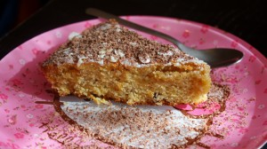

Когда я увидела у Джейми Оливера рецепт "Orange and polenta cake" ("Апельсиноый и кукурузный торт"), то сразу захотелось его попробовать. Так получилось, что в день его приготовления не оказалось многих ингредиентов, поэтому родилась моя версия этого замечательного тортика.
 
На вкус он очень нежный, с апельсиновыми нотками и такой хрупкий за счет кукурузной муки!
 
Для этого чудного десерта вам понадобятся:
 
1. Сливочное масло - 200 грамм (комнатной температуры).
1. Коричневый сахар - 200 грамм.
1. Яйца (крупные) - 3 штуки.
1. Пшеничная мука - 100 грамм.
1. Кукурузная мука - 170 грамм.
1. Молотый грецкий орех - 30 грамм.
1. Цедра двух апельсинов.
1. Разрыхлитель теста - 1 ч. л.
1. Ваниль или ванильный сахар (половина пакетика).

 
Для сиропа:
 
1. Апельсиновый сок - 250 мл. (2-3 апельсина).
1. Щепотка кардамона.
1. Сахар - 125 грамм.

 
Форма круглая диаметром 20-21 см, смазанная маслом и посыпанная слегка мукой. Если используете силиконовую форму, достаточно слегка смазать маслом.
 
Включаем заранее духовку при 160-165 градусах.
 
Готовим тесто по принципу кексового теста.
 
Взбиваем сливочное масло комнатной температуры до слегка кремового цвета, добавляем коричневый сахар и снова взбиваем. Масса будет однородная, но с крупинками сахара.
 
Затем добавляем по одному яйца и продолжаем взбивать.
 
В отдельной посуде соединяем просеянную муку (пшеничную и кукурузную), цедру апельсина, ванильный сахар (ваниль), разрыхлитель и молотый орех.
 
Все перемешиваем и добавляем к нашей жидкой массе.
 
Все тщательно перемешиваем до однородной золотистой массы и выкладываем в форму.
 
Отправляем наш апельсиновый сюрприз в духовку минут на 40-50 до появления золотистого цвета.
 
После выпекания, изделию дать немного постоять в выключенной духовке (минут 5) .
 
Пока выпекается тортик сделайте апельсиновый сироп. Можно его сделать заранее, убрав в холодильник.
 
Выливаем апельсиновый сок в глубокий ковшик (сотейник), добавляем сахар и ставим на средний огонь. Варим минут 5 до состояния сиропа. В конце варки добавляем щепотку кардамона.
 
Сироп остудить до теплого (холодного состояния).
 
Прокалываем наш тортик шпажкой до самого дна и поливаем его сиропом.
 
Украшаем тортик сахарной пудрой, лепестками миндаля и цедрой апельсина.
 
А вообще, украшение это ваше желание завершить начатое. Поэтому какое украшение будет на вашем тортике, такое ваше и видение!
 
Смело фантазируйте!
 
Дайте немного постоять вашему апельсиновому тортику и смело на стол!
 
Очень вкусно кусочек тортика будет сочетаться с натуральным йогуртом или со сметаной, политой сиропом.
 

 
Для некоторых, маленьких принцесс, этот десерт будет совершенен с тертым шоколадом!
 

 
Ах, какой нежный, яркий, солнечный вкус!
 
Приятного аппетита!
 

