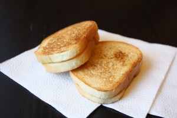
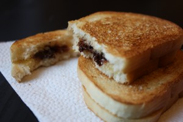

Кто читал довольно популярное произведение Карен Ле Бийон "Французские дети едят все и ваши могут", тот вспомнит, что в конце этой книги автор прилагает несколько вариантов блюд французской кухни, ориентированных на деток. Так вот там есть рецепт этого очень простого десерта "Бабушкин шоколадный багет".
 
Взяв за основу наши российские ингредиенты (свежий батон), а не свежеприготовленный французский багет, можно приготовить свой вариант, который оценят дети по достоинству!
 
Помните как многие из нас в детстве баловали себя кусочком булочки, смазанным сливочным маслом и присыпанный сахаром. Или вариант просто хлеб с сахаром политый почему-то заваркой :-)
 
Так вот этот вариант можно так сказать родственник наших детских экспериментов.
 
На две детские порции вам понадобятся:
 
1. Четыре кусочка свежего батона.
1. Четыре квадратика от шоколадной плитки (только содержание какао-бобов 65-70%).
1. Сливочное масло.

 
Мой вариант можно приготовить очень быстро на газу. Но если есть время, то можно и с помощью духовки.
 
Ставим сухую сковороду на огонь до хорошего нагрева. Кладем каждый кусочек на сковороду на небольшое время (минута-две), переворачиваем и снова оставляем ненадолго. Смотрите под ваш огонь и ваши возможности сковородки.
 
Батон должен сегка подсушиться, но не сгореть.
 
Вынимаем кусочки. Сковороду оставляем на газу дальше, можно газ немного убавить. И довольно быстро смазываем все четыре кусочка сливочным маслом (небольшим слоем). Поверх двух кусков кладем дробленную шоколадную крошку и прикрываем оставшимися кусочками.
 
Получаем вроде сендвича.
 
Снова отправляем получившиеся заготовки (две сборные штуки) на сковороду и сверху на них можно поставить свободную посуду вроде груза. Даем еще немного подсушить (около минуты).
 
Убираем с огня, выключаем газ и все!
 
Даем детям с подогретым молоком, как вариант, и дети чмокают и хрустят свежеприготовленным "Бабушкиным шоколадным багетом".
 
Если делать оригнальный вариант, то ваш процесс ускориться вразы. Поскольку багет остается без термообработки и он хрустит сам по себе.
 
А шоколад выбирайте с высоким содержанием какао-бобов, поскольку он имеет полезные свойства.
 
Таким же способом я люблю подсушивать и хлеб, как на газу, так и в духовке, и он являются прекрасной основой для различных бутербродов, брускет (итальянский вариант) и так далее.
 

 

 
Приятного вам чаепития!
 
Bone appetite!

