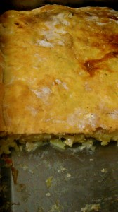
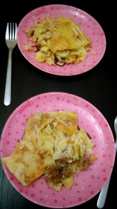

Бялеш - традиционное татарское блюдо. В моей семье это обязательный элемент праздничного стола. Бабушка его непременно делает огромного размера, чтобы всем хватило :-) Помимо вкусного содержания: картофеля, мяса, лука, у него необычная хрустящая корочка. Мой вариант намного проще, более адаптирован под требования моих домочадцев. В нем нет лука, зато много другого, что позволяет его сделать сочным, ароматный и сытным блюдом для вечерней трапезы! Для его приготовления необходимо: 
1. Небольшой кусок говядины (можно с жиром) грамм 400.
1. Картофель 1 кг.
1. Морковь средняя 1 шт.
1. Капуста белокочанная 1/3 шт.
1. Чеснок 1-2 головки.
1. Молоко 300 мл.
1. Сыр (любой твердый, полутвердый) 100-150 грамм.
1. Растительное масло.
1. Соль, перец, специи (по вкусу).

 Для верхней хлебной шапки: 
1. Яйцо 1 шт.
1. Молоко или вода 50 мл.
1. Мука 200-300 грамм (до состояния мягкого, эластичного теста).
1. Соль, перец.

 Заранее приготовьте противень. Разогрейте духовку при 180-190 градусах. Я использовала большой противень, поэтому такое количество ингредиентов. Можно убавить ровно на половину и приготовить в круглой форме (диаметром 20-21 см.) Для начала разогрейте духовку до 200 градусов. Картофель, морковь, чеснок очистить. Капусту нашинковать не очень мелкими полосками. Картофель разрезать пополам и нарезать тонкими кусочками (около 2-3 миллиметров). Морковь натереть на крупной терке. Чеснок просто раздавить любым тяжелым предметом, например лезвием ножа. Все эти ингредиенты перемешать, посолить, поперчить. При желании можно добавить любимые специи. Я в этом случае не стала их класть, так как аромат чеснока и капусты приятно сочетаются. Мясо слегка отбить и нарезать тонкими полосками. Противень полить растительным маслом щедро, 3-4 ст. ложки. Выложить картофель, капусту, морковь и чеснок на противень, сверху равномерно распределить кусочки мяса. Сделаем заливку. Сыр натереть на крупной терке. Соединить сыр с молоком. Дополнительно посолить и поперчить. Смесь вылить на начинку. Для теста необходимо яйцо смешать с водой или молоком, добавить соли щепотку, немного перца и постепенно добавлять муку. Тесто должно получиться мягким. Раскатайте из него пласт величиной в ваш противень. Накройте пластом теста свою начинку, и прижмите с краев. Как бы укутывая начинку в одеяло :-) Сделайте несколько отверстий вилкой. Смажьте пласт из теста яйцом (это можно сделать, а можно и не сделать :-) Кладем наш бялеш в духовку на час, час с лишним, все зависит от вашей печки (180-190 градусов). Ну вот и все! Сытный, ароматный ужин, а может и обед готов!   Приятного аппетита! 
