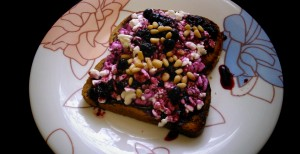

Легкий, сытный и пожалуй необычный завтрак.
 
Вам понадобятся на 2 порции: 1. Ломтики хлеба (зерновой) 2 штуки. 2. Творог зерновой или любой другой грамм 100. 3. Черники грамм 50. 4. Сахар или мед 1 ст.ложка. 5. Кедровые орешки по щепотке на порцию.
 
Разогреть сковороду и поджарить ломтики хлеба. Если есть тостер, то сделать тосты. Чернику подавить с сахаром или медом, чтобы ягодки размякли и пустили сок. Выкладываем на кусочки хлеба творог, поливаем ягодный сиропом и посыпаем орехами. Ну как? Сами понимаете, что все ингредиенты могут быть на ваш вкус и цвет!
 

 
По моему мнению, брускетта это типа нашего русского понимания бутерброда.
 
А если углубляться в подробности, то Брускетта ([итал.](https://ru.wikipedia.org/wiki/%D0%98%D1%82%D0%B0%D0%BB%D1%8C%D1%8F%D0%BD%D1%81%D0%BA%D0%B8%D0%B9_%D1%8F%D0%B7%D1%8B%D0%BA) bruschetta или реже bruschetto от bruscare — запекать на углях (в [романском](https://ru.wikipedia.org/wiki/%D0%AD%D0%BC%D0%B8%D0%BB%D0%B8%D1%8F-%D0%A0%D0%BE%D0%BC%D0%B0%D0%BD%D1%8C%D1%8F) диалекте)) — [традиционное](https://ru.wikipedia.org/wiki/%D0%98%D1%82%D0%B0%D0%BB%D1%8C%D1%8F%D0%BD%D1%81%D0%BA%D0%B0%D1%8F_%D0%BA%D1%83%D1%85%D0%BD%D1%8F) центрально-итальянское простонародное блюдо (имеющее аналоги и в других регионах), в наше время — закуска-«[антипасто](https://ru.wikipedia.org/wiki/%D0%90%D0%BD%D1%82%D0%B8%D0%BF%D0%B0%D1%81%D1%82%D0%BE)» перед основными приемами блюд для «поднятия аппетита». Отличительная особенность брускетты от [бутерброда](https://ru.wikipedia.org/wiki/%D0%91%D1%83%D1%82%D0%B5%D1%80%D0%B1%D1%80%D0%BE%D0%B4) или [тоста](https://ru.wikipedia.org/wiki/%D0%A2%D0%BE%D1%81%D1%82%D0%BE%D0%B2%D1%8B%D0%B9_%D1%85%D0%BB%D0%B5%D0%B1) в том, что ломтики [хлеба](https://ru.wikipedia.org/wiki/%D0%A5%D0%BB%D0%B5%D0%B1) предварительно обсушивают до прожаривания (на гриле, решётке или на сковороде без масла). Идеально для приготовления брускетты подходит [чиабатта](https://ru.wikipedia.org/wiki/%D0%A7%D0%B8%D0%B0%D0%B1%D0%B0%D1%82%D1%82%D0%B0) (информация из Википедии).

