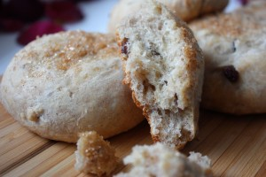
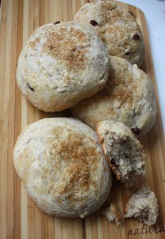

Иногда уж больно хочется чего-нибудь дрожжевого. Ведь это прекрасная возможность сохранить малую долю традиций наших предков по изготовлению выпечки тех времен и передать вкус нашим детям.
 
Я очень люблю выпечку такого рода! Только в силу своих экспериментальных особенностей хочется чего-нибудь изменить, добавить.
 
Мука пшеничная в сочетании с другими видами муки просто восхитительно!
 
В данном рецепте моя самая любимая цельнозерновая мука.
 
Вообще, основа рецепта была позаимствована на просторах интернета как «рецепт пышных оладьев».
 
Поэтому можно по данному рецепту приготовить оладьи на сковороде или испечь прекрасные булочки!
 
Булочки воздушные и совсем не тяжелые. Их можно причислить к диетическим, поскольку в них практически отсутствует сахар и масло! Да, кстати, этот рецепт будет удобен тем, кто предпочитает не пользоваться весами.
 
Вам понадобятся:
 
1. Мука пшеничная 200 грамм.
1. Мука цельнозерновая 100 грамм.
1. Дрожжи свежие 10 грамм (где-то 1 ст. ложка).
1. Стакан теплого молока (220 мл.)
1. 1 яйцо.
1. 1 ст. ложка сахара.
1. Ванильный сахар (по вкусу).
1. 1/3 ч. л. Соли.
1. 1 ст. л. Растительного масла.
1. Орехов молотых (грецких, миндаль, фундук) 3 ст. л.
1. 1 горсть изюма.

 
Заранее разогрейте духовку при 180 градусах.
 
Просейте всю муку.
 
Сделаем опару.
 
В теплое молоко добавляем дрожжи и сахар. Всю жидкость выливаем в некоторую часть муки (около 100 грамм). Все тщательно перемешиваем и оставляем в теплом месте созревать, прикрыв полотенцем.
 
Минут через 20-30 ваша опара будет готова. Она увеличиться в несколько раз.
 
В отдельной миске взбиваем яйцо венчиком. Яйцо соединяем с опарой, добавляем остальную часть муки, соль, растительное масло и замешиваем тесто. Снова оставьте это тесто на некоторое время (20-30 минут), накрыв полотенцем.
 
По истечение времени добавьте к тесту изюм и молотые орехи (я использовала грецкие).
 
Тщательно перемешиваем и формуем шарики размером с кулак. По необходимости добавляем еще немного муки.
 
Выкладываем колобочки на смазанный растительным маслом пергамент или коврик для выпекания.
 
Сверху (по желанию) можно посыпать сахаром белым или коричневым как в моем варианте.
 
Кладем в духовку при 180 градусах на 20-30 минут.
 
В конце готовки поглядывайте, чтобы шпажка выходила сухой и булочки были немного румяные.
 
Вот и все!
 
 
 
Приятного аппетита!
 
Да, и не забывайте себя и близких баловать вкусной и здоровой выпечкой!

