Знаете есть такие вкусные сдобные булочки, которые вкусно пахнуть корицей и они пропитаны сладким пресладким сиропом. А если внутри еще и орешки, то это просто объедение!
 
С дрожжевым тестом имею дело редко, разве что при изготовлении основы для пиццы. Поэтому решила посмотреть рецепты таких булочек. Их просто множество!
 
Выбрала первый попавшийся, оказался очень удобный и несложный рецепт.
 
Как только дошло дело до приготовления, я поняла, что того нет и того мало.
 
В итоге, я сделала с заметными изменениями, но получилось очень даже ничего!
 
Тесто вышло пышное, нежное и как мне кажется не совсем тяжелое, что характерно для дрожжевых изделий.
 
- Для таких плюшек вам понадобится:

 
1. Теплое молоко (я использовала молочную сыворотку) 250 мл.
1. Яйца комнатной температуры - 2 шт.
1. Сметана - 75 грамм.
1. Растительное (оливковое масло) - 2 ст. л.
1. Пшеничная мука - 500 грамм.
1. Цельнозерновая мука - 100 грамм.
1. Соль - 1 ч. л.
1. Сахар - 90 грамм.
1. Быстрые дрожжи - 3 ч. л.

 
- Для сказочной начинки (2 вида):

 
1. Сливочное масло комнатной температуры - 50 грамм.
1. Корица молотая - 2 ст. л.
1. Орехи (любые) измельченные - пол стакана.
1. Сахар 1 стакан или около 300 грамм (можно и больше, можно и меньше).
1. Мак немолотый - 70-80 грамм.
1. Цедра 1/2 лимона, сок лимона 2-3 ст. л.

 
- Для нежной сладкой глазури:

 
1. Творог домашний (любой незернистый) -100-150 грамм.
1. Сливки или сметана - 2 ст. л.
1. Сахарная пудра - 100 грамм.
1. Соль - щепотка.
1. Лимонный сок - 1 ч. л.

 
Совсем не надо боятся такого количества ингредиентов. Это все оправдано и в итоге мы получим то самое, что хотели!
 
Кстати, цельнозерновую муку можно вовсе заменить на пшеничную. Мне просто очень нравится, когда тесто имеет какой-то особенный оттенок во вкусе и цвете.
 
Приступим к изготовлению.
 
Начнем с теста. В большую кастрюлю или глубокую миску наливаем теплую молочную сыворотку добавляем к ней дрожжи, затем сахар, соль, яйца и все перемешиваем. Дальше добавляем сметану и растительное масло, перемешиваем. После засыпаем муку двух сортов и замешиваем тщательно тесто. Получается очень мягкое липкое тесто. Я его оставляю прямо в таком виде, накрываю крышкой и полотенцем и оставляю в теплом месте где-то на час, полтора.
 
Итак, наше тесто подошло. Оно увеличилось в несколько раз и стало воздушным и непослушным.
 
Выкладываем его на присыпанную мукой поверхность и формируем из него плотную массу, добавляя немного муки. Достаточно чтобы оно не прилипало к рукам и поверхности.
 
Затем раскатываем его в огромный прямоугольник (или что-то типа того), толщиной 2-3 мм. То есть не очень тонко и не очень толсто!
 
Разрезаем прямоугольник на два длинных прямоугольника. Для наглядности небольшой рисунок :-)
 
[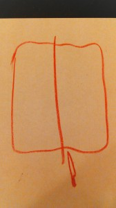](wpid-img_20141204_1903441.jpg)
 
Смазываем оба пласта мягким сливочным маслом.
 
Ставим духовку на 200 градусов разогреваться.
 
Приготовим начинку. В одну миску положите корицу, сахар (около 150 грамм, или пол стакана), орехи и смешайте. В другую миску - мак, сахар (в таком же количестве), цедру лимона и немного сока лимона.
 
Каждый прямоугольный пласт посыпаем нашей сказочной начинкой.
 
И аккуратно, прилагая некоторые физические усилия, сворачиваем наши пласты в рулеты. И снова небольшой рисунок :-)
 
[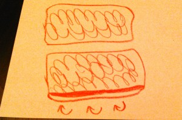](wpid-img_20141204_191201.jpg)
 
В итоге получились два длинных рулета. Смазываем противень для выпечки растительным маслом (и дно и стенки), так как булочки увеличатся в размере.
 
Разрезаем рулет на небольшие кусочки (около 2-3 см. толщиной).
 
Переворачиваем кусочки и выкладываем на противень. Прижимаем их слегка, так чтобы получились не дудочки, а как бы "завитушки".
 
Даже если высыпается начинка, это тоже хорошо! То что рассыпалось посыпьте на булочки.
 
Оставьте булочки ненадолго на противне и в духовку минут на 12-15 до золотистого цвета.
 
[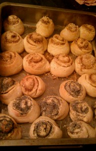](wpid-img_20141204_194119.jpg)
 
Пока наши пышечки доходят займемся глазурью.
 
Творог надо тщательно взбить или прокрутить в блендере до состояния кашицы. Добавляем сметаны или сливок, пудру, соли щепотку и немного лимонного сока и все тщательно взбиваем.
 
В итоге получается кремовая сладкая масса.
 
На еще теплые (даже горячие) булочки накладываем нашу глазурь с помощью кисточки или просто ложкой. Она прямо так и будет таять у вас на глазах!
 
Вот и готовы наши прелестные булочки!
 
[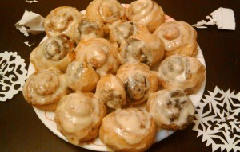](wpid-img_20141202_170427.jpg)
 
Кому какие по вкусу, с корицей или маком.
 
[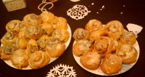](wpid-img_20141204_194015.jpg) [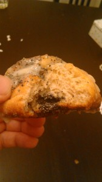](wpid-dsc_1505-e1417711743215.jpg)
 
P. S. Я совсем не была готова выкладывать свой рецепт на сайт, так как делала дрожжевые булочки впервые. Но поскольку булочки получились ну просто замечательные, я быстро написала по горячим следам рецепт.
 
И рада поделиться им со всеми!
 
Приятного сладкого чаепития!
 

 
Небольшие дополнения от 27.01.2015 г.
 
Сделала эти булочки повторно, ну просто вкусно!
 
В этот раз мака не оказалось дома, поэтому я один пласт покрыла творогом с яблочным пюре и сахаром. А второй также как и в рецепте, с корицей и орехами.
 
Прилагаю фотографии.
 
Наслаждайтесь приготовлением и соответственно поеданием всего этого!
 
[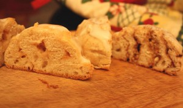](IMG_2781.jpg) [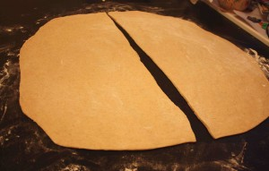](IMG_2748.jpg) [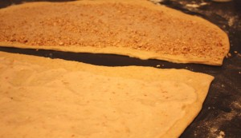](IMG_2754.jpg) [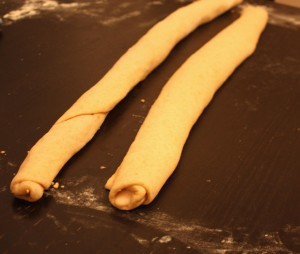](IMG_2758.jpg) [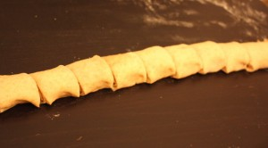](IMG_2761.jpg) [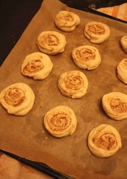](IMG_2764.jpg) [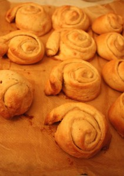](IMG_2767.jpg) [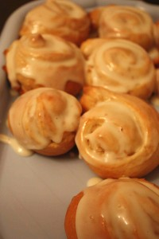](IMG_2770.jpg) [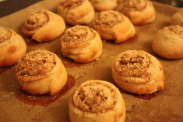](IMG_2779.jpg)

