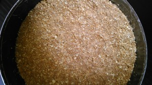
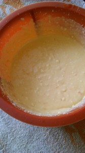
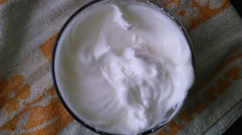
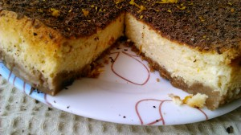
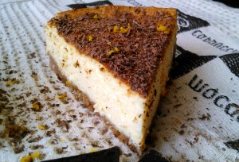

Творожные блюда моя любимая тематика. Сама люблю творог и детям необходимо.
 
Рецептов чизкейка уйма, особенно его классики (с сыром маскарпоне или рикоттой). Но дома постоянно тянет к обычной, привычной с детства еде. Творог знаком нам с самого далекого детства.
 
По цене десерт выходит намного экономичнее, чем с заморскими сырами :-)
 
Соответственно, чем жирнее творог, тем жирнее и маслянистее получается десерт!
 
Вам понадобится:
 
- Основа:

 
1. Печенье галетное (можно любое) 70 грамм.
1. Сахар 1 ст. ложка.
1. Масло сливочное 50 грамм.
1. Какао-порошок 1/2 ст. ложки.

 
- Начинка:

 
1. Творог 250 грамм.
1. Сметана 50 грамм.
1. Яйца 4 штуки.
1. Сахар 4 ст. ложки.
1. Кукурузная мука 30 грамм.
1. Цедра апельсина 1 шт.
1. Мед 1 ст. ложка (для аромата).
1. Немного шоколада и цедры апельсина для украшения.

 
Разогреваем духовку до 160 градусов.
 
Приготовьте разъемная форму для торта или любую другую круглую форму (около 20-23 см. в диаметре). Форму смазываем сливочным маслом.
 
Печенье измельчаем до состояния крошки, либо скалкой через полотенце или в блендере (что намного удобнее :-)
 
Печенье смешиваем с мягким маслом, какао и сахаром.
 
Массу кладем в форму и прижимаем руками, твердым предметом, чтобы крошка приняла состояние основы под чизкейк.
 

 
Форму с основой убираем в холодильник.
 
В это время занимаемся начинкой.
 
Отделяем белки от желтков.
 
К желткам добаляем творог, сметану, 2 ст. ложки сахара и все тщательно смешиваем.
 
Затем добавляем кукурузную муку, цедру апельсина и мед. Смешиваем.
 

 
В отдельной миске взбиваем венчиком (удобнее миксером) белки до состояния пышности, добавляем 2 ст. ложки сахара. Продолжаем взбивать, чтобы получить устойчивую пену (минуты 3 на это надо).
 

 
Желточную и белковые смеси аккуратно соединяем и выливаем на основу.
 
Кладем в духовку при 160 градусах на 45-50 минут.
 
После приготовления НЕОБХОДИМО не вынимать блюдо минут 10-20, чтобы все составляющие пришли в себя!
 
Затем убрать в холод как минимум на 30 минут.
 
Совет: на дно духовки можно поставить противень с водой. При приготовлении получается эффект водяной бани, который облегчает приготовление чизкейка. Можно, обернув фольгой форму, поставить в противень наполненный водой.
 
Практически всегда творожные десерты трескаются. Значит десерт удался!
 
Добавьте тертого шоколада и цедры и он будет выглядеть просто неотразимо в глазах окружающих :-)
 
А цитрусово-медовый аромат добавит шарма обычной, привычной, творожной запеканки :-)
 

 

 
Приянтного аппетита!

