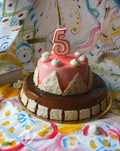
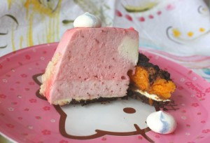
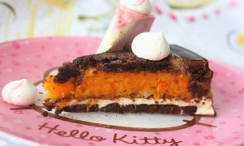

 
 

 

 
Прекрасный праздник - День рождения!
 
Вдвойне прекраснее, если этот праздник детский!
 
По эксклюзивному эскизу моей дочери и был создан этот десерт к праздничному столу. Заказчику хотелось шоколадный первый этаж и клубничный второй этаж замка. Так и родились эти два замечательных тортика!
 
Первый торт: шоколадный бисквит без муки, мусс из темного шоколада, мусс с белым шоколадом и лимоном, абрикосовое желе. Второй торт: шоколадный бисквит без муки, клубнично-мятный мусс, клубничный маршмеллоу, легкий карамельный крем.
 
Оформление: глазурь, безе, миндальный дакуаз.
 
Двойное наслаждение на праздничном столе!
 
Стоимость индивидуальная.
 
Для оформления заявки надо перейти на страницу [Главная.](../shop)
 

