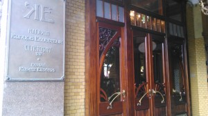

 
Пожалуй каждому известно, что город Санкт-Петербург это северная столица России, основанный при Петре I в 1703 году и так далее. Можно много и долго говорить об этом красивом городе.
 
Мне бы хотелось вам рассказать об одной пешей прогулке по главному проспекту Санкт-Петербурга - Невскому проспекту.
 
14 сентября 2014 г. выдался теплый осенний денек и я решила прогуляться в центре Петербурга (так мне больше нравится его называть), оставив всех своих домочадцев и все домашние хлопоты на несколько сокровенных часов свободы!
 
Переместилась до указанного места довольно быстро и доступно, средствами метрополитена.
 
Я вышла на станции "Площаль Восстания" в направлении к Невскому проспекту. Очень удобно! Ты вышел из метро и уже на Невском.
 
Как обычно, даже в середине сентября здесь много туристов. Все ходят туда-сюда, очень шумно, постоянно мчатся машины, автобусы. Шумно, красиво до неприличия, но в этом весь он, Невский!
 

 
Мой маршрут был проложен очень просто. Я двигалась по той стороне Невского, где вышла из метро и медленно шла в направлении к Дворцовой площади.
 
Еще в самом начале меня заинтересовал огромный современный торговый центр на углу Невского проспекта и улицы Восстания. Кажется он назывался Стокманн или Невский. Да это и не важно. Главное то, что он такой современный, красивый и расположен прямо среди старых величавых Невских построек. Мне стало любопытно, как этот огромный торговый центр поместился здесь. Я быстренько заглянула увидела всю его объемистость, эскалаторы, просторные торговые секции и все жутко гламурно и роскошно, что мне сразу захотелось выйти и не тратить время зря.
 
С радостным и восторженным видом я направилась дальше. Солнца вначале совсем не было, но затем оно словно увидело меня и сказало "Привет!" И это приветствие длилось всю мою прогулку и это было замечательно!
 
Пока ты идешь "мимо пролетают дорогие лимузины", и везде, буквально на каждом квадратном метре расположены кафе и рестораны. Свежий воздух, различные ароматы (от дешевых запахов чизбургера и картошки фри до приятного аромата свежеприготовленного кофе с вкусной булочкой ....) От этих запахов конечно и есть захотелось.
 
Меня привлекла вывеска "Кондитерская Север Метрополь". Разве я могу пройти мимо!
 
Зашла, а там огромное количество всяких яств, в основном десерты. Не удержалась и приобрела кофе Латте и Чизкейк. Было очень вкусно и сытно. Огромные оконные рамы, через которые можно видеть как Невский движется каждую минуту, а ты сидишь такая неподвижная, делаешь глоток кофе и радуешься жизни!
 
Получив, теперь еще и внутренний заряд энергии, я направилась дальше по проспекту. Совсем скоро я увидела выставку фоторепоржата военного Ленинграда. Решила зайти. И не пожалела об этом. Поскольку период Великой Отечественной Войны останется навсегда шрамом в сердце у каждого.
 
 
 
Невольно просыпается воображение и по спине даже дрожь от увиденных снимков того времени, то голодные блокадники Ленинграда, то взрослый взгляд ребятишек, лишенных родителей по неволе.
 
Выходя из здания, я вижу белый свет и говорю себе еще раз, что жизнь прекрасна! Надо только увидеть это.
 
Я направляюсь дальше по Невскому. Вижу вдалеке виднеется мост через канал. Эти мощные статуи с лошадьми и всадниками. Как выяснилось позже это знаменитый Аничков мост через реку Фонтанку.
 
Когда стоишь на мосту то открывается прекрасный вид на реку по которой постоянно движутся прогулочные кораблики. И все так и хотят встать и сфотографироваться на фоне этой красоты! Конечно же я не исключение и поддалась соблазну.
 

 
 
 
Прошла некоторое расстояние и увидела какой-то шикарный, в прямом смысле этого слова шикарный магазин продуктов. Название солидно "Магазин купцов Елисеевых".
 
Внутри этого магазина все до неприличия красивое. К примеру, те же самые орехи, но как они выглядели в витрине и сколько стоили?! Будто там не орехи, а золотые украшения. Там и сыры всяких видов и пирожные и мороженое.
 

 
В общем, все в самом ярком свете! Наверное для туристов, так как стоимость всего завышена в несколько раз.
 
Посмотрела, даже сфотографировала эти "экспонаты" (с разрешения охранника) и направилась дальше.
 
  
 
Проходя мимо какой-то арки, я заметила надпись во дворе "Парк культуры и чтения" (ул. Невский проспект 46). Как не зайти!
 

 
Огромное, кажется трехэтажное здание и все занято книгами и всякими такими предметами. Оказалось магазин "Буквоед".
 
Пока я искала что-нибудь для моих девочек, услышала о каком-то мастер-классе. Решила поинтересоваться у продавца. Мне сказали, что бесплатный мастер-класс по изготовлению сумки. Я конечно же не смогла отказаться от этого увлекательного мероприятия и пошла!
 
Было весело и забавно красить специальными красками белый кусок хлопковой ткани. Получилась оригинальная сумка, которая крепиться на плече простыми узлами. На память у меня осталось пару пятен на кофте. Ну кто мог сразу понять, что краски несмываемые.
 
 
 
После замечательного мастер-класса, я приобрела пару детских книжек.
 

 
И в прекрасном настроении продолжила путь.
 
На этом месте можно было бы и остановиться. Но я ведь не останавливаюсь на полпути и продолжила путь по знаменитому Невскому проспекту!
 
Он ведь такой, свободный и это чувствуется везде, на каждом шагу!
 
Люди, находясь здесь, дают волю своим творческим фантазиям и это приятно и неповторимо!
 
 
 
Идешь и снова мост, их здесь огромное количество!
 
Мост через канал Грибоедова, ну просто невозможно бросить взгляд на Храм Спаса на Крови с его прекрасной разноцветной мозаикой.
 

 
А напротив на меня глядит мой любимец - Казанский собор! Он такой величественный, такой масштабный и в то же время хмуро-серый. Но все таки прекрасен!
 

 
Ну вот и финиш, подумала я когда увидела просторную Дворцовую площадь.
 
 
 
Но это оказался еще не конец моей истории. Поскольку возле площади я послушала волшебное исполнение музыки индейцами; небольшую ярмарку всякой всячины
 
 
 
и наконец, наконец я увидела Неву!
 
 
 
Какой свежий воздух и простор, когда стоишь на набережной и смотришь на эту дикую, свободную реку!
 
Какой же гениальный был человек Петр I.
 
Сколько всего и сколько сразу смог поместить в себя самый главный проспект Санкт-Петербурга, Невский!
 
Наверное пришел момент завершения моего яркого рассказа, так как все самое интересное я постаралась написать. Но ведь это мое открытие Невского, а не ваше!
 
Вперед к открытиям!
 
