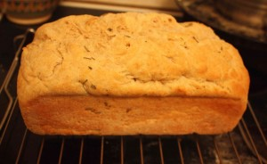
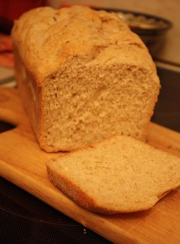

Почему универсал? Да потому, что это прекрасное тесто подойдет как для сладкой выпечки, так и для хлеба или для основы пиццы.
 
В общем, этот рецепт не секрет и не мною придуман. Его автор Джейми Оливер (да, все тот же Джейми). Он так увлекательно его делает (передача "Голый повар") и рецепт совершенно прост!
 
Итак, для прекрасного дрожжевого теста нам понадобятся:
 
1. Мука (пшеничная) 1 кг.
1. 625 мл. воды.
1. 30 грамм свежих дрожжей или 2 х 7 грамм сухих дрожжей.
1. 2 столовые ложки сахара.
1. 2 ч. л. соли.
1. немного муки на для раскатки теста.

 
Начнем с того, что тесто можно делать в большой миске, а можно как по рецепту на чистой поверхности.
 
Я выбираю второй вариант. Он немного оригинален и увлекателен.
 
Нужен чистый кулинарный стол и вилка.
 
Высыпаем всю муку на поверхность.
 
Делаем в муке посередине небольшой колодец (или дырочку).
 
Вливаем в него где-то 1/4 жидкости, засыпаем дрожжи (я использую сухие), сахар, соль. И аккуратно перемешиваем все что в колодце, захватывая по чуть-чуть муку с краев колодца. Постепенно частями вливаем оставшуюся воду.
 
Внимание! Добавляем воду по чуть-чуть и все время смешиваем воду с мукой.
 
В итоге получаем кашицу, которую уже невозможно замешивать вилкой. Поэтому переходим на ручную работу.
 
Активно и энергично замешиваем тесто, немного добавив муки, чтобы тесто стало эластичнее и отошло от рук.
 
Вот такой приятный на ощупь колобок кладем в глубокую миску (кастрюлю и т. д.), накрываем чем-нибудь и оставляем в тепле без сквозняков на 30-40 минут.
 
Через указанное время заглядываем, а там воздушное (увеличенное как минимум вдвое) тесто!
 
Это тесто еще активно разминаем около минуты. Вот и все!
 
Тесто "универсал" готово!
 
Половину его я обычно кладу в морозильную камеру, так как из всего теста можно просто уйму выпечки сделать.
 
А из остального теста можно сделать к примеру, хлеб. Правда в данном конкретном случае я муку использовала не полностью пшеничную, а с добавлением цельнозерновой (800 грамм пшеничная и 200 грамм цельнозерновая).
 
Разогреваем духовку до 180 градусов.
 
В форму для выпечки хлеба (да в любую глубокую, но не объемную) наливаем 1 ст. л. растительного масла, размазываем по дну и стенкам. Засыпаем чуточку муки и постукиваем по форме, чтобы ее всю распределить (по дну и стенкам).
 
Кладем тесто в форму, распределяем руками и в духовку минут на 25-30.
 
А можно почти как Джейми - посыпать поверхность теста крошенным розмарином и полить 2-3 ст. л. оливкового масла.
 
И самое интересное, пальцами вдавливать до самого дна всю поверхность.
 
В духовку минут на 30-40 до готовности.
 

 

 
Приятного домашнего времяпровождения!

