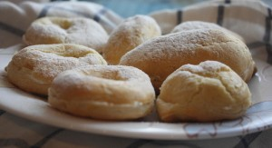
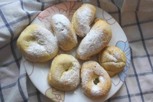

 
 
Нежнейшие эклеры из заварного теста со сливочным кремом (крем Шарлотт) с добавлением какао-порошка либо без. А может и с кусочками любимых фруктов и ягод.
 
Также творожные кольца из заварного теста с ароматным нежным творожным кремом внутри.
 
Все это можно украсить сахарной пудрой, помадкой, шоколадной глазурью. Все по Вашему пожеланию!
 
Стоимость эклера - 45 руб. штука.
 
Стоимость творожного кольца -55 руб. штука.
 
Заказ при количестве не менее 10 шт.
 
Для оформления заявки надо перейти на страницу [Главная.](../-s)

