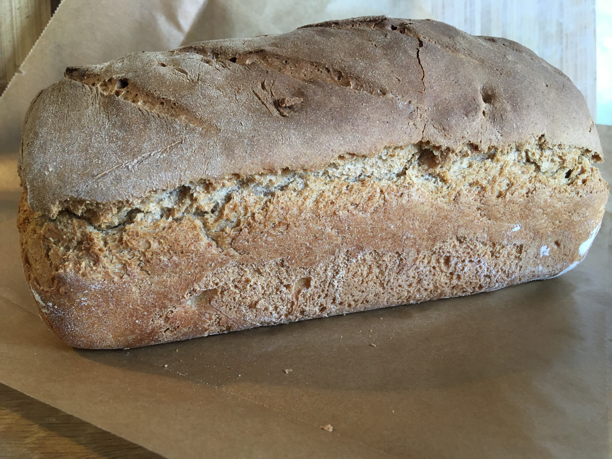
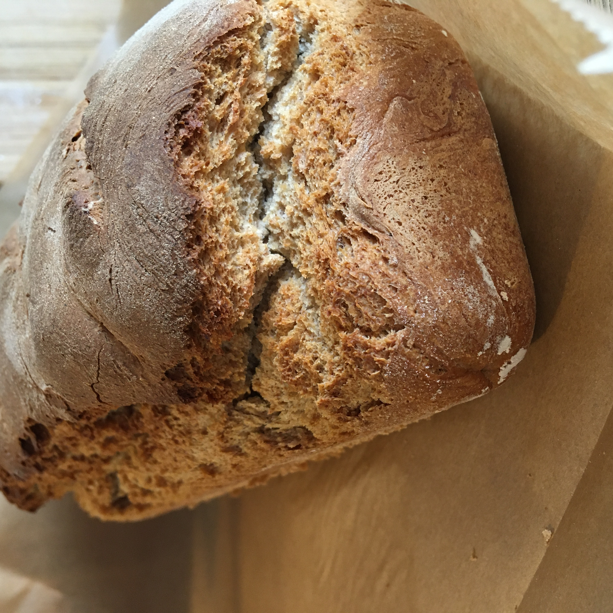
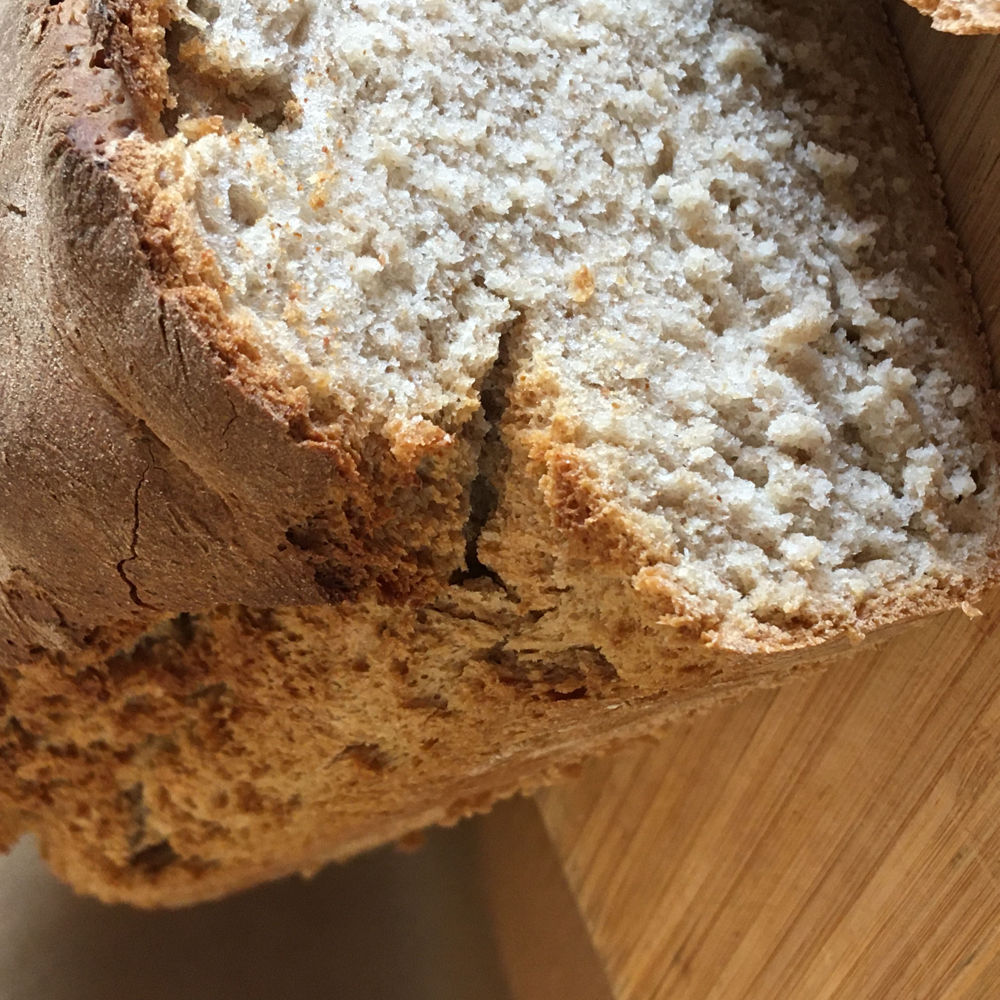

Кто не любит аромат свежеиспеченного хлеба?
Если еще добавить кусочек сливочного масла, ммммм!

Есть замечательный рецепт теста для пиццы от Джейми. Все кто интересуется, могут смело найти и видео и рецепт на английском языке в Ютубе.
Я начала с него, потому что сегодня не пицца, а хлеб!

Почему же основа для пиццы не может быть основой для хлеба?

На примере этого рецепта я вам это покажу.

**Для теста вам понадобится:**

1. 350 грамм пшеничной муки
2. 150 грамм ржаной муки
3. 1/2 ст.л. соли
4. 1/2 ст.л. сахара
5. 325 мл воды
6. 16 грамм свежих дрожжей
7. 2 ст. л. оливкового масла

Необходимо муку просеять в глубокую миску. К муке добавить соль, сахар.
Отдельно растворить дрожжи в воде, добавив оливкового масла. Пару минут дать постоять.

Затем всю жидкость выливаем в смесь муки и вилкой смешиваем все воедино.

Тут начинаем замес. Делаем его активными движениями рук, периодически добавляя небольшое количество муки.
С тестом надо работать не меньше 10-15 минут.

Когда оно готово? Когда оно будет слегка пружинить при надавливании пальцем и полностью уже отходить от рук.

Тесто оставить в миске приблизительно на час в теплом месте, прикрыв полотенцем.

Оно поднимется и увеличится вдвое.

Заранее разогреваем духовку до 210-220 градусов. На самую нижнюю полку ставим противень или любую жароустойчивую посуду с водой.

Тесто еще недолго помесить и поместить в форму для запекания. Я использую прямоугольную форму для запекания кексов.

Кладем в духовку минут на 20-27.

Как видите, ручной работы с тестом было совсем немного, а результат порадует всех!

С теплым ароматом домашнего очага!

> Заметки: Это тесто прекрасно подходит как основа для пиццы; можно с мукой экспериментировать и ржаную заменить на другие виды муки; можно смело добавить прованских трав и оливок в тесто, орехов и т.д.
