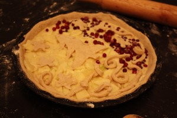
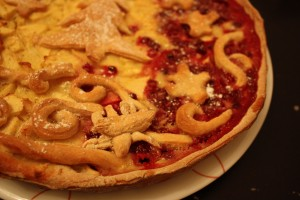
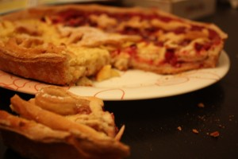

Сегодня прекрасный зимний день! Выпал снег и кажется еще идет не переставая. Очень хочется чего-то горячего, сытного и по-настоящему домашнего. Часто наши мамы и бабушки пекли пироги, пирожки из дрожжевого теста. Это и есть то самое "домашнее". Как говорит Алиса ("Алиса в стране чудес"): - От сдобы добреют; от уксуса куксются.... Сегодня тот самый денек, когда мы стали немного добрее :-) Для этого самого обычного пирога мне понадобилось дрожжевое тесто (смотрите рецепт по ссылке [тесто](../drozhzhievoie-tiesto-univiersal)). Разогреваем духовку до 180 градусов. Готовим начинку. Все что есть в холодильнике. Два яблока, немного брусники, сахара 3-4 ст. л., ванильного сахара 1 ч. л., сливки или сметану (100-150 грамм), 1 яйцо. Яблоки очистить и нарезать тонкими полосками и смешать со всеми вышеперечисленными ингредиентами (кроме брусники). Тесто раскатываем, выкладываем в смазанную маслом форму. Затем кладем начинку, бруснику и украшаем остатками теста. Моя дочь сделала из колбасочек теста снежинку.  Кладем в духовку минут на 30-35. Вот и готов наш теплый домашний десерт. Немного "припудриваем" сахарной пудрой.   Приятного чаепития! 
