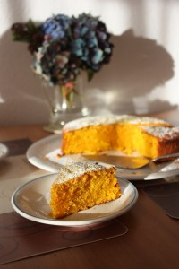

Вчера сделали ну просто замечательный пирог к первому дню обучения в школе старшей дочери Полины! В один заход съели половину пирога. А ведь младшая дочь не особо любит тыкву, а добавки попросила.
 
Дело не в тыкве или моркови, дето-то в эффекте этих продуктов на всеь состав пирога. За основу я брала отличный рецепт от andychef.ru "Пирог с фруктовым пюре или тыквой". У него все прекрасно написано и самое главное использует очень доступные для всех нас ингредиенты!
 
В моем пироге не так много растительного масла, сахара и совсем нет соды, разрыхлителя и красителя.
 
Натуральным красителем здесь выступает яркая молодая морковка и те сорта тыквы, которые имеют сочный оранжевый цвет мякоти. В моем случае я покупала две маленькие тыковки к Хеллоуину. Просмотрев в интернете про разновидности тыкв, мною купленные кажется похожи по всем параметрам на тыквы сорта "Гилея" или "Мирани Ди Киоджа". Маленькие, ярко-оранжевого цвета снаружи и внутри и с сочной, сладкой мякотью.
 
(Позже нашла наименование на ценнике, это тыква Sunny Hokkaido).
 
Фото для наглядности.
 

 
Морковь я использовала в свежем виде, а вот мякоть тыквы заранее выпекала в духовке слегка присыпав сахаром. Выпекаются маленькие кусочки очень быстро, при 140-150 градусах -10-15 минут. Затем размяла вилкой и получила очень вкусное, сладкое, яркое пюре. Я его ложкой как варенье ела.
 
Ну да ладно, приступим к нашему пирогу.
 
Для его приготовления нам понадобится:
 
1. Мука - 200 грамм
1. Тыквенное пюре - 150 грамм
1. Морковь (свежая, среднего размера) тертая на мелкой терке - грамм 30-40
1. Растительное масло - 200 грамм (можно даже еще убавить до 180-190 граммов)
1. Сахар - 180 грамм
1.  Яйца (средние или большие) - 3 штуки
1. Мед (любой) - 1 ч. л.
1. Корица молотая - 1,5 ч. л.
1. Щепотка соли.

 
Заранее разогреваем духовой шкаф до 170 градусов. Как и по совету andychef желательно использовать нагрев нижний и верхний, чтобы тесто понималось равномерно. В моем случае я использовала нижний и верхний нагрев с вентилятором.
 
Если у вас нет таких оригинальных встроек, можно обойтись и без них. Просто при выпечке, минуте на 10, смотрите за пирогом. Возможно понадобиться немного убавить или прибавить. А в конце можете покрыть сверху фольгой, если вам покажется, что тесто сверху сыровато.
 
А вообще, пирог в готовом виде чем-то напоминает Муале, в котором очень мягкий, влажный мякиш.
 
Белки отделяем от желтков. К желткам добавляем растительное масло, пюре тыквы, тертую морковь, сахар и все перемешиваем. Даже взбивать не потребовалось. Главное образовать однородную массу.
 
Далее добавляем корицу, мед, соль и муку. Снова все перемешиваем.
 
Отдельно в чистой и сухой посуде взбиваем белки до состояния мягких пиков. Соединяем взбитые белки с желктовой массой, стараясь не потерять объем (принцип как при изготовлении [бисквита](../tort-konfietti)).
 
Выливаем в заранее смазанную сливочным маслом и присыпанную мукой форму. Я использовала кольцо диаметром 21 см. И отправляем позагорать на солнышке минут на 20-25. Тесто начнет подниматься, появится румянец и по дому запляшет аромат пирога!
 
Выключаем духовку и можно его еще оставить с приоткрытой дверцей на пару минут. Затем дает остыть, посыпаем сахарной пудрой. И если в момент посыпания пирог еще не до конца остыл (как в моем нетерпеливом случае), то появится необычный эффект. Гранулы сахарной пудры будут приобретать желтый цвет и это очень даже интересно!
 
Приятного яркого чаепития!
 
Bone appetite!
 
P. S. Я хотела как-то по короче, а вышло как всегда. Просто есть много нюансов и хочется с ними тоже поделиться!
 

