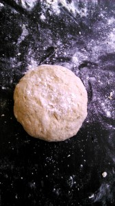
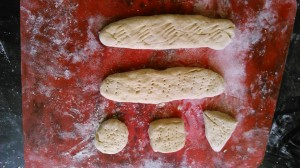
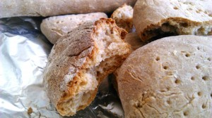

Испекла хлеб буквально пару раз, а уже хочется добавить чего-то своего. Не бойтесь экспериментировать, это расширит ваши возможности!
 
Вот и этот хлеб не исключение. Получился даже не хлеб, а приятный хлебец. С приятным медовым вкусом и хрустящей коркой.
 
Вам понадобится:
 
1. Пшеничная мука 200 грамм.
1. Ржаная мука 100 грамм.
1. Разрыхлитель теста 1,5 ч. л.
1. Соль 1 ст. ложка.
1. Молочная сыворотка (можно воды) 200 мл.
1. Мед 1 ст. ложка.
1. Растительное масло 2 ст. ложки.

 
Разогреваем духовку до 200 градусов.
 
Все сухие смеси (мука, разрыхлитель, соль, сахар) смешиваем.
 
Делаем колодец в центре и в него вливаем мед, растительное масло.
 
Затем постепенно вливаем сыворотку и замешиваем сперва вилкой от центра, двигаясь к краям. Потом замешиваем руками. Добавляем пшеничну муку по необходимости.
 

 
Готовим хлеб разной формы и выкладываем на пекарскую бумагу, резиновый коврик (либо смазанный маслом и посыпанный мукой противень).
 

 
Ставим в духовку до готовности.
 
Поскольку я делала хлеб маленькими формами, то у меня ушло минут 25.
 
P.S. Про такой способ замешивания теста я узнала из видеофильма Джейми Оливера ("Голый повар"), где он замешивал дрожжевое тесто для пиццы. Он мне так понравился. Теперь я всегда его использую. Это интересно и забавно!
 

 
Всем приятного аппетита!

