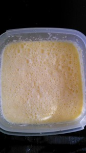
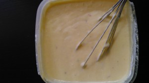
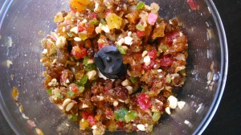
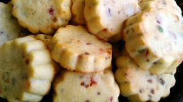
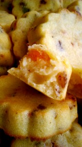

Периодически делаю творог и сыворотки молочной остается в избытке.
 
Вот и придумала очередной рецепт с использованием сыворотки.
 
Получились вкусные, сочные и солнечные (за счет кукурузной муки) кексики.
 
Вам понадобится:
 
1. Пшеничная мука 300 грамм.
1. Кукурузная мука 150 грамм.
1. Сливочное масло 110 грамм.
1. Сметана 260 грамм.
1. Молочная сыворотка (можно молока) 0,5 литра.
1. Сахар 1 стакан.
1. Яйца 3 штуки.
1. Рахрыхлитель теста 1 ч. л.
1. Цукаты измельченные 150 грамм.

 
Разогреваем духовку до 180 градусов.
 
Сахар смешиваем вместе с мягким сливочным маслом. Удобно пользоваться вилкой. Затем добавляем сметану и миксером или венчиком взбиваем массу и добавляем по одному яйца.
 
В готовую неоднородную смесь вливаем сыворотку, взбиваем.
 
Просеянную муку (пшеничную и кукурузную) вместе с разрыхлителем добавляем к массе. Перемешиваем.
 

 

 
В конце кладем цукаты.
 

 
Нашу прекрасную смесь кладем в формочки для кексов.
 
Если форма силиконовая, то просто выливаем до половины.
 
Если форма металлическая, то предварительно надо смазать сливочным маслом и посыпать мукой. И тоже выливаем до половины.
 
Кладем в духовку при 180 градусах на 20 минут.
 
Даем остыть немного.
 

 

 
Приятного всем аппетита :-)

