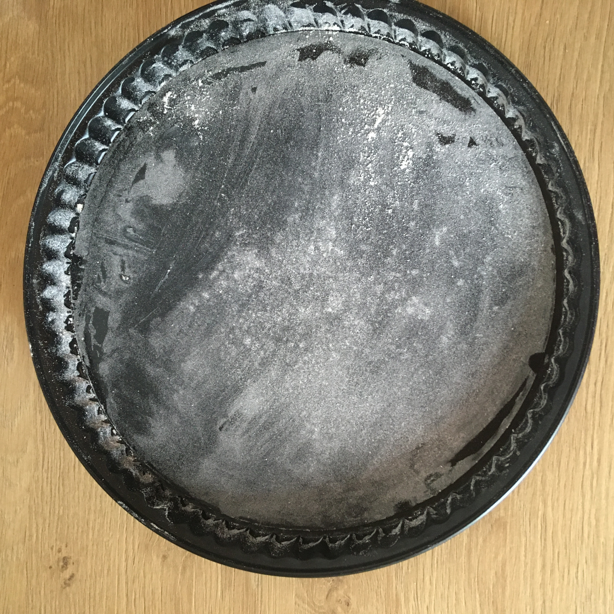
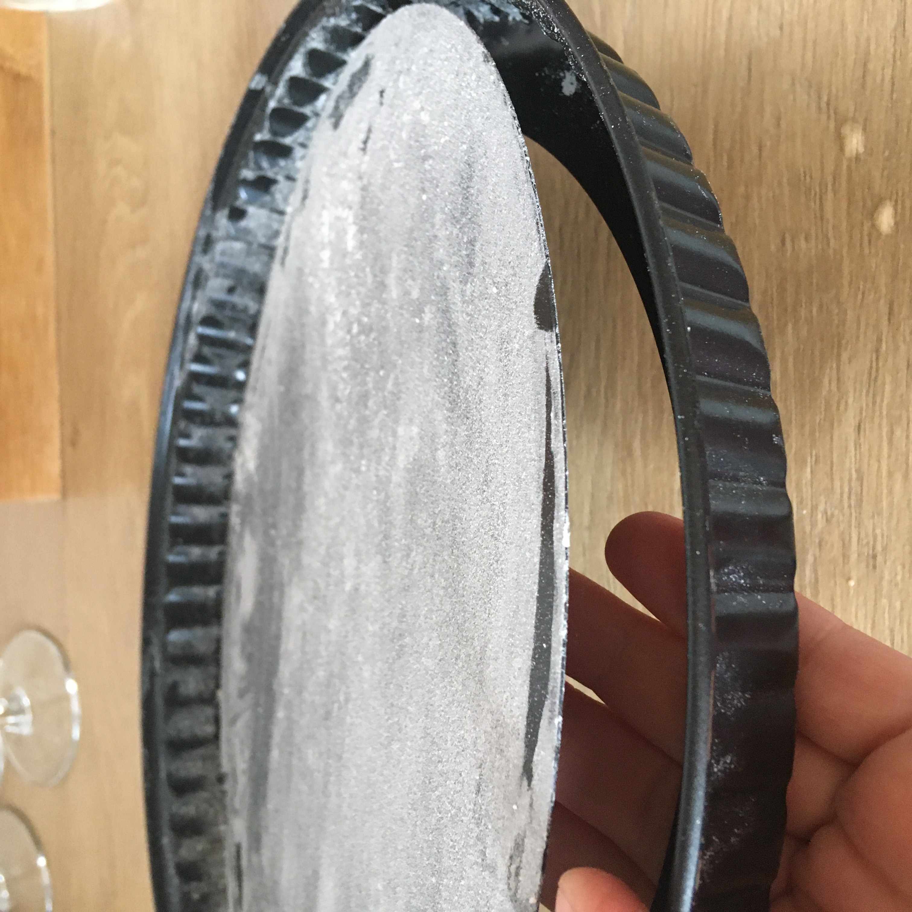
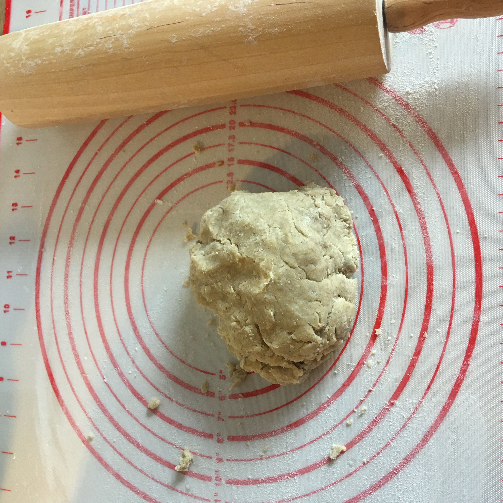
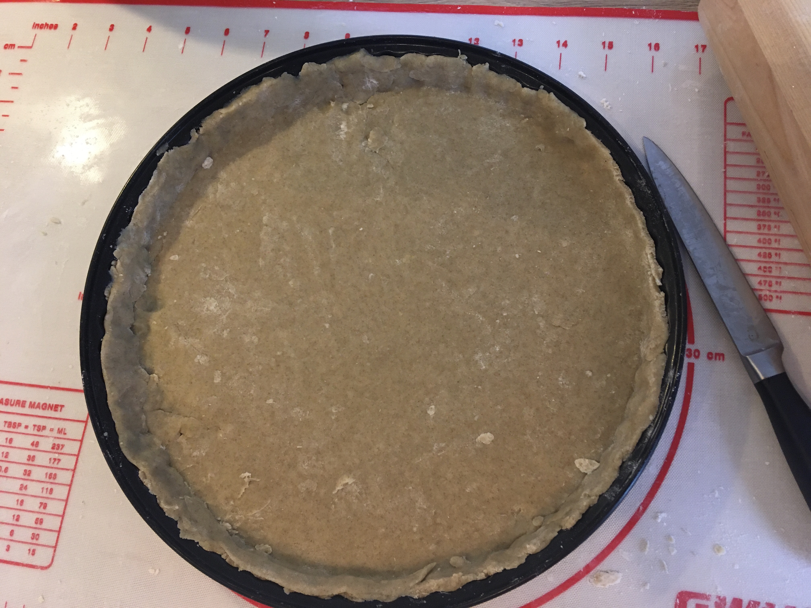
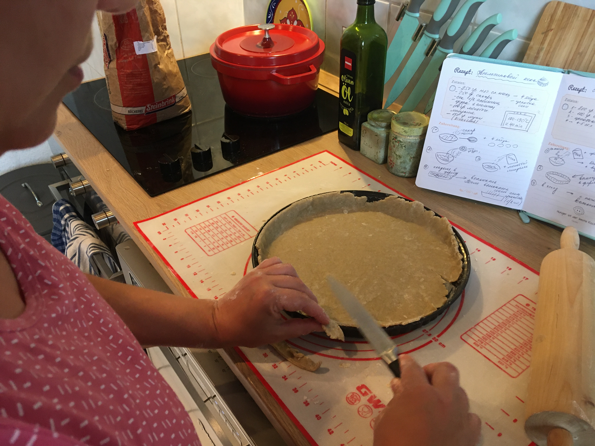
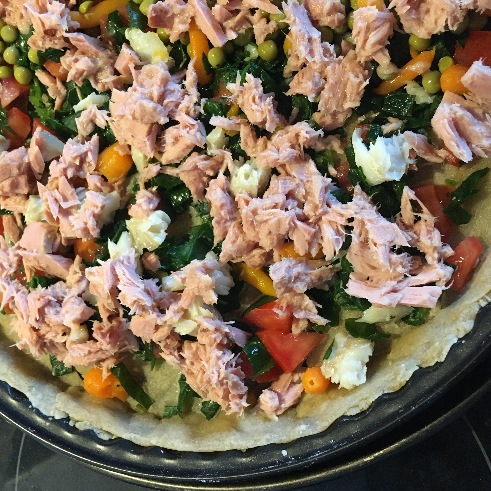
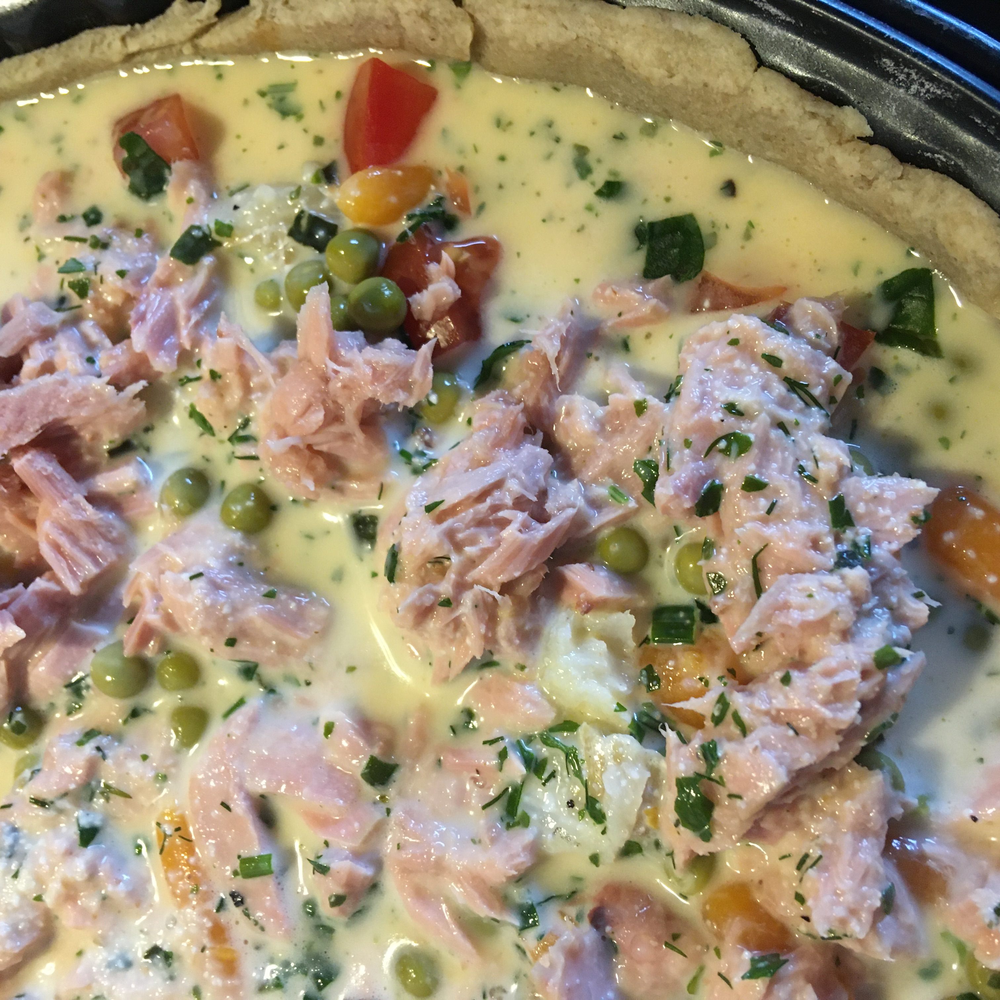
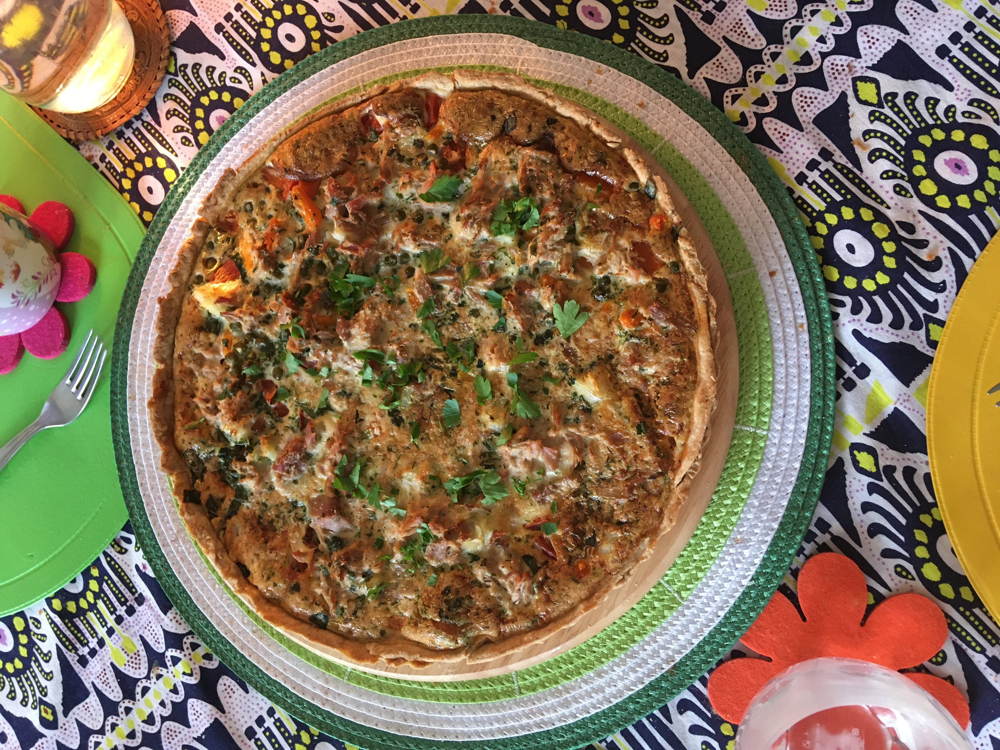
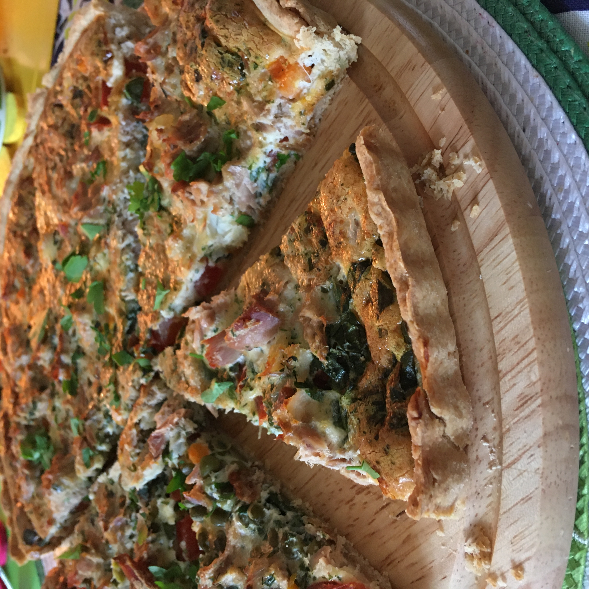

Прошло много времени с того дня, когда я в последний раз что-то записывала здесь.

Всем привет!
И вот с чего я начинаю. С обычного Киша! Слово какое необычное "Киш". Наверное многих сразу отталкивает и отговаривает готовить или даже думать о его приготовлении. Знакомо?
Меня вдохновляет творчество Ирины Чадеевой (Чадейка). Поэтому многие рецепты ее блюд я брала в основу, как например рецепт слоеного рубленого теста для Киша.

Скажу честно, чтобы получить ровную, красивую основу для теста нужно приобрести только нужную форму для Тартов и Кишей. Я тоже когда-то мечтала о ней и все-таки приобрела. И вы знаете, теперь приготовление теста стало намного проще и удобнее. Для наглядности прикладываю пару фото как выглядить форма в деле.

Ну, тогда начнем!

**Для теста нам понадобиться:**
1. 200 грамм пшеничной муки (часть муки я заменила ржаной, грамм 50)
2. 100 грамм холодного сливочного масла
3. щепотка соли
4. 4-5 столовых ложек холодной воды

**Начинка к Кишу:**
1. Консервированный тунец (1 банка) и кусочек любой приготовленной ранее рыбы
2. Томат 1-2 штуки
3. Консервированный горошек с морковкой (1 банка)
4. Шпинат - 50-100 грамм
5. 3 Яйца
6. Сливки жирные - 100 мл. (можно заменить молоком и тертым сыром)
7. Зелень по вкусу
8. Соль, перец

В просеянную муку надо добавить нарезанное кусочками холодное сливочное масло, щепотку соли.
Затем быстрыми движениями рук смешать эти ингредиенты. Затем добавить холодную воду и замесить тесто. Процесс замеса должен быть совсем недолгий, чтобы не позволить растаять маслу и превратить тесто в один сплошной ком, который после выпечки не сможет дать эффекта слоености.

Тесто надо убрать ненадолго (минут 30) в холодильник, прикрыв его.
Можно подготовить начинку.
Томаты нарезать небольшими кусочками. Смешать яйца со сливками в однородную жидкость, добавить специи и зелень.
В моих рецептах почти отсутствуют лук, сыр, так как не все любят эти ингредиенты.
Поэтому, сливки можно заменить молоком и тертым сыром (60-100 грамм) и к начинке добавить жаренного лука.
То есть, Киш это своеобразный конструктор вкусов и ингредиентов. Смело фантазируйте!

Разогреваем духовку до 200 градусов.

Достаем тесто из холодильника, раскатываем до диаментра формы (23-25 см).
Затем кладем его в форму, края делаем ровными, ну или почти ровными. В этом может вам помочь тупой конец ножа.
Можно снова охладить тесто уже в форме еще минут 10-15.

Затем выкладываем ровными слоями на тесто шпинат, томат, гороше, морковь, рыбу и заливаем в конце яично-сливочной смесью.

Кладем в духовку и забываем минут на 20-25.

Киш можно подавать слегка его остудив или даже холодным.

Приятного аппетита или Bon Appétit!

 > Из наблюдений: начинка будет вздуваться в процессе выпекания, затем она осядет; тесто можно заранее не выпекать если начинка не совсем жидкая, например как в этом рецепте.
