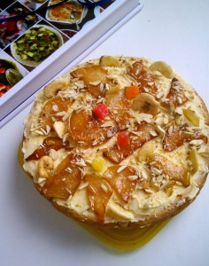
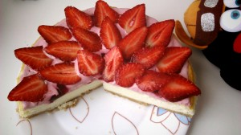
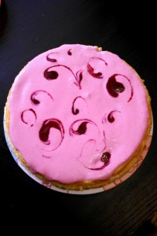
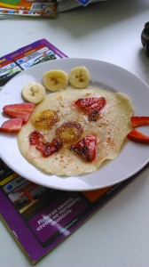

Бывают случаи когда есть чем угостить, все супер, но не хватает чего-то для полной картины. Я это называю вдохновение! И тут на помощь приходит фантазия! У каждого она своя и неповторимая. Я к чему все это. Так вот в этом разделе я буду выкладывать удачные, а может и не очень, попытки проявить свою фантазию при украшении десертов и блюд. 1. Украсила торт на свой День рождения всем тем, что было дома. Использовала: - груши 2 шт. - сахар 3-4 ст. л. - цукаты - горсть. - сушенные бананы - горсть. - миндаль - горсть. Нарезала груши тонкими дольками и прикрыв сахаром, пожарила на сковороде до состояния карамелизации. Остудила. Выложила на торт в произвольной форме, затем бананы, цукаты. И сверху покрошила через терку миндалем. Вроде ничего!  2. Запеканка или творожный чизкейк с ягодами. Использовала: - клубнику свежую - несколько штук. Была запеканка, появилась клубника, а почему ее не пустить в ход! Клубнику помыть и нарезать тонкими (около 3 мм.) ломтиками вдоль. Выложить на десерт от краев к середине, как лепестки цветка. На выходе, свежий десерт!  3. Украшаем вареньем, джемом. Использовала: - теплое варенье из ягод. На покрытую поверхность десерта (в данном случае смесь сметаны, сгущенки и варенья) льем сверху варенье, тонкой струйкой. Рисуем и фантазируем в свое удовольствие! Не забудьте охладить.  4. Украшаем блины. Детский вариант. Использовала: - клубнику, бананы, сахар. Полила сковороду блином и выложила кусочки банана и клубники, посыпала сахаром. Поджарила и украсила. В данном случае получилась то ли птица, то ли рыба :-)  До новых свежих фантазий! 
