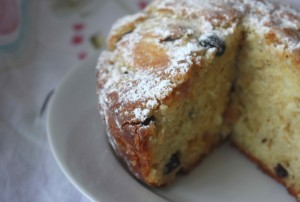
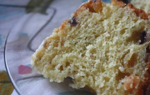

   
Куглоф - это разновидность бриоши с добавлением изюма и молотых орехов. Европейский десерт на основе дрожжевого теста, покрытый сахарным сиропом и "ореховым" маслом. Пожалуй, альтернативой можно назвать выпечку "Ромовая баба".
 
Это совсем не кекс и совсем не дрожжевая булочка.
 
Куглоф это сливочно-масляный аромат, мягкий мякиш и волшебство вкуса!
 
Это стоит попробовать!
 
Также выпекается в форме с отверстием.
 
Стоимость индивидуальная.
 
Для оформления заявки надо перейти на страницу [Главная.](../-s)
 
