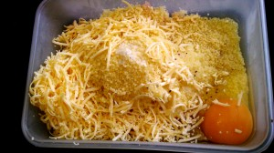

Куриные котлетки очень нежные и сочные и совсем нежирные.
 
И пожалуй, важное примечание, это отсутствие лука!
 
Для тех кто не любит лук добро пожаловать на эту страничку.
 
Вам понадобится:
 
1. Куриное филе 200-300 грамм.
1. Картофель крупный 1 штука.
1. Яйцо 1 штука.
1. Сыр твердых сортов грамм 50.
1. Кускус половина стакана (около 80 грамм).
1. Оливковое масло.
1. Соль, перец и любимая специя (в моем случае розмарин).

 
Приготовьте сковороду, налейте оливковое масло около 3 столовых ложек.
 
Куриную грудку нарезать маленькими кусочками, стараясь добиться состояния фарша.
 
К курице добавить тертый на мелкой терке сырой картофель и сыр, сухой кускус, яйцо, соль, перец по вкусу.
 

 
Сковороду поставить на средний огонь.
 
Куриную смесь перемешать до состояния кашицы. Формируем маленькие котлетки.
 
К раскаленной сковороде добавляем мелко нарезанный розмарин (1-2 ветки), около 30 секунд даем розмарину включится в работу :-)
 
Кладем на сковороду в розмариновом масле котлетки.
 
Обжариваем с двух сторон по 1-2 минуте.
 
Затем наливаем чуточку воды, накрываем крышкой, убавляем огонь до маленького состояния.
 
В качестве гарнира можно все, что вы любите (лапша, спагетти, рис...).
 
И обязательно овощи! Небольшой салатик только украсит стол.
 

 
Всем приятного аппетита!
 Форми
