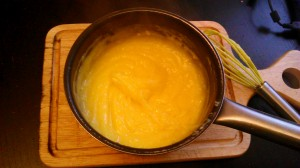
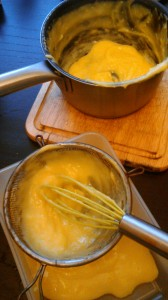

Этот прекрасный лимонный крем я делала дважды. Первый раз по рецепту Ирины Чадеевой, второй по рецепту из Foodtube Cupcake Jemma (Джемма).
 
Оба оказались прекрасны!
 
Как раз о втором я хочу написать, поскольку на ютубе ролик англоязычный и этот вариант мне показался более нежным.
 
Для лимонного курда нам понадобятся:
 
1. 5 яичных желтков и 2 целых яйца.
1. Цедра 1 лимона.
1. Лимонный сок - 110 мл (где-то 2 средних лимона)
1. Сахар - 110 грамм.
1. Сливочное масло - 60 грамм (из холодильника).

 
Джемма по видеоролику делает этот вариант на паровой бане. Я же упростила задачу и сделала просто на маленьком огне.
 
Итак, разделяем белки от желков у 5 яиц.
 
Выжимаем сок из лимонов. Выливаем в ковшик 110 мл. лимона, добавляем цедру одного лимона, желтки и 2 целых яйца и сахар.
 
Все аккуратно перемешиваем и ставим на средний огонь. Все время помешиваем. Минуты 2 на среднем огне, затем убавьте на маленький продолжаем помешивать. Все это продолжается до появления кремового густого состояния.
 
Затем даем этой массе немного остыть и кладем нарезанное кубиками сливочное масло. Перемешиваем.
 

 
Всю эту сочно-лимонную массу пропускаем через сито.
 

 
Посмотрите, вот он, наш чудесный лимонный крем!
 
Его можно есть просто так из ложечки, а можно украсить десерт.
 
Фантазии нет предела, фантазируйте на славу!
 
Огромное спасибо Foodtube и всем кто придумал этот замечательный рецепт!
 
Приятного аппетита!
 
