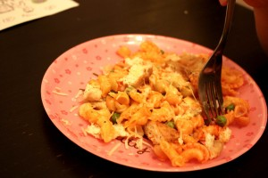

Очередной экспромт в стиле Джейми.
 
Вкусно, быстро и сытно!
 
Для куриных котлет вам понадобятся:
 
1. Куриное филе - 200 грамм.
1. Картофель - 2 шт.
1. Сыр - 100 грамм.
1. Яйцо - 1 шт.
1. Соль, перец по вкусу.
1. Сушеный базилик щепотку.
1. Для панировки - гречневая мука и пшеничная мука.
1. Оливковое (2 ст. л.) и сливочное масло (1 ст. л.)

 Для гарнира: 
1. Отварные макароны.
1. Отварной зеленый горошек (1 стакан).
1. Томатная паста - 2 ст. л.
1. Соль, перец - по вкусу.
1. Лимонный сок - 2 ст. л.
1. Оливковое масло.

 
Кладем в блендер куриное филе кусочками, яйцо и все перекручиваем.
 
Отдельно почистили картофель и перетерли на мелкой терке.
 
Также сыр перетираем на мелкой терке.
 
Все соединяем, добавляем соль, перец, сушеный или свежий рубленный базилик.
 
Ставим сковороду на большой огонь. Через полминутки, наливаем оливковое масло и сливочное масло.
 
Делаем котлетки, обваливаем их в мучной смеси и выкладываем на сильно разогретую сковороду. Обжариваем с каждой стороны с минуты, полторы чтобы котлетки схватились. Затем наливаем немного воды в середину сковороды, накрываем крышкой и убавляем огонь на средний уровень. Готовим минут 5-7, периодически посматривая. Если надо добавляем еще немного воды.
 
Котлетки готовы!
 
Отвариваем любые макароны. Параллельно варим минут 5 свежий (замороженный) зеленый горошек.
 
Поливаем макароны оливковым маслом.
 
К отварным макаронам выкладываем горошек, добавляем 2 ст. л. томатной пасты, соль, перец - по вкусу и немного лимонного сока для свежести. Все это жарим с минутку и все!
 
Наше вкусное и сытное блюдо готово!
 
Всем приятного аппетита!
 
P. S. На фотографии детская порция, где куриные котлетки были поделены на несколько кусочков.
 
Или вариант с тертым сыром при подаче.
 
Так любит моя младшая дочь :-)
 

