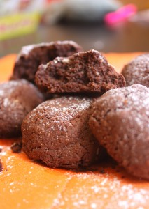
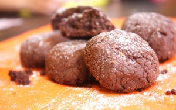

Иногда приходится обращаться ко всяким интернет страницам, видеоресурсам чтобы иметь представление о новинках или просто позаимствовать понравившийся рецепт.
 
Так вот, люблю я FoodTube! Там все наглядно и понятно.
 
Решили с дочерью сделать что-нибудь на "скорую руку" и чтобы шоколадненькое было.
 
Заглянули в FoodTube, а там как раз новая рубрика под названием: "Simple Chocolate Cookies from Bryone Morganna".
 
Отличный рецепт быстрого приготовления!
 
Там всего три ингредиента: Нутелла, мука и яйцо.
 
 Поразмыслив, я решила Нутеллу заменить на другие, схожие ингредиенты.
 
Получилось волшебное, шоколадное, с хрустящей корочкой печенье!
 
Делалось оно очень быстро, и как следствие название получило быстрое "МегаШокПеченье".
 
Вам потребуется:
 
1. Темный и любой другой шоколада (50Х50) - 110 грамм.
1. Молотое печенье (любое) - 35 грамм.
1. Сливочное масло - 35 грамм.
1. Мука пшеничная - 140 грамм.
1. Крупное яйцо - 1 штука.

 Я использовала крошку от разного ранее приготовленного печенья, бисквитов (в общем, как на пирожное "Картошка"). Заранее разогреть печь до 180 градусов. Растапливаем шоколад в одной миске. Затем кладем к шоколаду сливочное масло. К этой массе добавляем муку, все тщательно перемешиваем. Далее кладем яйцо, перемешиваем до однородности. В итоге получаем очень темное, эластичное тесто. Из которого лепим небольшие колобочки. Выкладываем на пергамент и отправляем в духовку при 180 градусах на 10-15 минут! Масло из печенья будет немного вытекать при готовке, но это совсем не вредит конечному результату. Вынимаем, остужаем и наслаждаемся с чашечкой любимого чая!   Приятного аппетита! 
