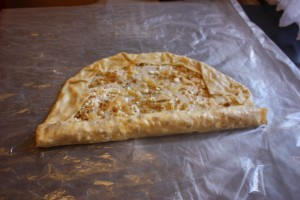
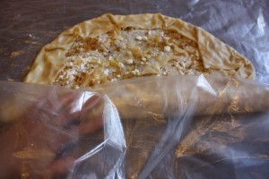

Сегодня я расскажу о том, как готовить Штрудель и совсем не бояться ошибок при приготовлении.
 
Рецептов Штруделя много, но тесто практически одинаково везде.
 
Мне очень нравится рецепт от Нины Тарасовой, только вместо уксуса я использовала лимонный сок.
 
На самом деле это один из самых наипростейших десертов в плане приготовления. Здесь нужны только "ловкость рук и никакого мошенства!"
 
Хочу сразу предупредить, что я использовала мало начинки и у меня вышло в итоге что-то среднее между Штруделем и Пахлавой. Поэтому если есть возможность добавить начинки по-больше, то получится настоящий мини-Штрудель!
 
Ну-с, начнем!
 
Для теста нам надо:
 
1. 200 г муки
1. 1 яйцо
1. 1 ч.л. уксуса (я заменила лимонной кислотой)
1. 2 ст.л. сливочного масла
1. 50 мл теплой воды

 
Для начинки нам надо:
 
1. 230 грамм творога зерненого (сухого или процеженного)
1. 1 горсть грецких орехов
1. 1 горсть изюма (любого)
1. Цедра одного лимона и лимонный сок (1-2 ч.ложки)
1. 4 ст.л. сахара
1. 1 яблоко.

 
Заранее разогрейте духовку до 200 градусов.
 
Сливочное масло растопите.
 
Смешайте слегка взбитое яйцо с водой и соком лимона (уксусом), затем добавьте муки. Начинайте разминать тесто, смазав руки растительным маслом. Можно тесто несколько раз отбить для лучшего схватывания.
 
Затем тесто убрать полежать на 30 минут, завернув его пищевой пленкой.
 
Для начинки творог освободить от жидкости. В моем случае творог был в сливках. И эти сливки мне пригодились для смазывания Штруделя.
 
Грецкие орехи, изюм накрошить ножом в среднюю крошку. Затем добавить цедру лимона и лимонный сок. Отдельно яблоко очистить от кожуры и натереть слайсами через терку или тонкими брусочками.
 
Когда тесто готово к работе. Приготовьте рабочую поверхность, стелим пленку и смазываем ее растительным маслом.
 
Выкладываем тесто на поверхность, раскатываем от центра к краям, оно очень податливое!
 
Затем возьмите в руки раскатанный пласт и его кистями рук растягиваем до практически прозрачного состояния. Конечно не стоит паниковать когда появляются небольшие дырочки, постарайтесь их защипнуть. Если даже не получилось это сделать, оставьте их на своем месте, это даже хорошо, через них будет выходить пар.
 
Таким образом получется пласт раскатанного теста приличного размера.
 
На тесто равномерно укладываем слой творога, затем слой орехов, изюма и цедры, после посыпаем яблоком или просто трем его сразу на поверхность.
 
По краю всего теста оставляем примерно по 2 см без начинки и затем их заворачиваем внутрь.
 

 
Сворачиваем наше тесто в рулет с помощью пленки, так как тесто очень нежное и тонкое.
 

 
Получились аккуратый рулетик. Отправляем его в духовку на 15 минут при 200 градусах, прикрыв фольгой.
 
По истечение этого времени, снимаем фольгу, смазываем Штрудель сливками от творога (можно молоком, желтком) и снова кладем в духовку на 20-25 минут.
 
Приятный, миниатюрный Штрудель готов!
 
Он идеально подходит в качестве полдника детям, когда их хочется чем-то удивить и побаловать!
 
Перед подачей можно посыпать сахарной пудрой, а можно просто добавить ложку сметаны.
 
Приятного аппетита!
 
Bone appetite!
 

