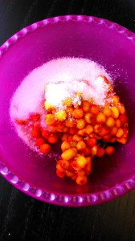
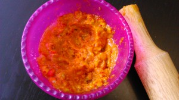

Пожалуй это самый любимый, самый солнечный морс на свете! И детям он тоже пришелся по вкусу. Делаю его быстро и стараюсь сохранить при этом максимум витаминов. Ингредиенты на 4 порции: 
1. Облепиха (свежая или замороженная) 150 грамм.
1. Сахар (по вкусу) или мед.

 Приготовьте кипяченную воду. Пока она немного остывает. В это время достаем облепиху, в моем случае замороженную. Слегка промываем в холодной воде через сито. Выкладываем в миску, добавляем сахар.  Начинаем разминать ее с сахаром толкушкой. У меня вместо толкушки "работает" скалка. Ризминаем пока все ягодки не пустили свой волшебный сок.  Затем кладем одну, две чайные ложки в чашку и заливаем слегка остывшим кипятком. Размешиваем.  Детям я переливаю в стаканчики через сито, кладу трубочки и они пьют за милу душу! Будьте здоровы! 
