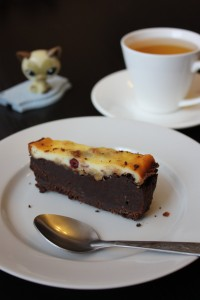
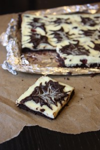

Всем привет!
 
Давно я здесь не появлялась.
 
Наступила осень, вчера был 1 сентября, а значит запах школы и осенней листвы под ногами!
 
Очень захотелось чего-то горячего и насыщенного исполнить в этот день.
 
Мой выбор пал на Брауни!
 
Этот десерт очень, ну очень легко сотворить. Притом никаких усилий прикладывать не надо, шоколад все сделает сам за себя.
 
На просторах интернета очень много рецептов этого десерта.
 
Я делала разные варианты.
 
Этот для меня немного новый, поскольку здесь используется чуть больше ингредиентов чем обычно.
 
Я этот рецепт нашла из ролика на Ютуб в английской версии (https://www.youtube.com/user/EntertainingWithBeth). Очень интересные рецепты и видео!
 
В моей версии часть ингредиентов заменена из-за отсутствия оригиналов и что-то добавлено по воле душевного полета!
 
Ну так приступим к нашему осеннему десерту!
 
Нам понадобится (на два отдельных десерта):
 
Для теста "Брауни":
 
- 240 грамм сливочного масла.
- 113 грамм сладкого шоколада (молочного) или шоколадных чипсов.
- 339 грамм темного шоколада (72% и выше).
- 200 грамм сахара тростникового (можно заменить на обычный).
- 1/2 ч. л. ванильного экстракта (или 1 палочку ванили или 1/2 пакета ванильного сахара). Только натуральной ванили!
- 1 ч. л. сухого кофе.
- 3 яйца.
- 120 грамм муки (просеянной).
- 1/2 ч. л. соли.
- 1/2 ч. л. соды.

 
Для теста из сливочного сыра:
 
- 226 грамм сыра (можно заменить сухим однородным творогом или я часть заменила сметаной (200 грамм сыра и 26 грамм сметаны).
- 2 яйца.
- 1/2 ч. л. ванильного экстракта (или смотрите выше).
- 15 грамм муки (просеянной) (или при добавлении сметаны 25 грамм).

 
 Разогреваем духовой шкаф до 175 градусов.
 
Если вы планируете сделать маленькую версию Брауни, то можно смело уменьшить ингредиенты на два.
 
Для начала делаем тесто для самого Брауни.
 
Для этого растапливаем сливочное масло, добавляя в него весь шоколад.
 
Затем кладем ваниль, кофе. Как только масса станет однородной и не горячей, вы добавляете яйца. Тщательно перемешиваем, взбивать не надо.
 
В конце к полученной смеси кладем все сухие ингредиенты, заранее просеянные.
 
Перемешиваем и откладываем в сторону.
 
Для теста со сливочным сыром все делается намного проще.
 
К сыру добавляем яйца, сахар, немного взбиваем.
 
В конце кладем ваниль и просеянную муку. Все перемешиваем.
 
Итак, мы получили две интересные, ароматные массы.
 
Теста оказалось довольно много, поэтому я заливала в две разные формы.
 
Не забываем, что формы надо смазать маслом и посыпать мукой или проложить пекарскую бумагу или в данном случае фольга тоже подойдет.
 
Первая форма.
 
Я залила в квадратную форму (20х20 см) на дно слой Брауни (где-то 1/4 общей массы). Затем практически всю сырную массу поверх Брауни (где-то 2/3 общей массы).
 
И как на видеоролике, по одной столовой ложке выкладывала слой Брауни в разных местах. Затем рисовала шпажкой (зубочисткой) линии, чтобы получить очертания листьев. Сверху немного посыпала сушеной клюквой.
 
Оставшее тесто я использовала для второй формы (прямоугольная, глубокая форма 10х25 см. для хлеба или кекса).
 
Вниз полила слой оставшейся массы Брауни, затем посыпала по центру дробленными орехами кешью и сушеной клюквой. Последним слоем покрыла оставшимся сырным слоем.
 
Все отправила запекать при 175 градусах на 25-30 минут.
 
При этом, не надо забывать, что Брауни в глубокой форме выпекаться будет чуть дольше и в конце можно ее прикрыть фольгой.
 
И наверное самое важное свойство для всех Брауни это не торопиться его вынимать из формы.
 
Для схватывания и образования кремообразной текстуры Брауни должен постоять некоторое время, остыть и придти в себя.
 
И только после этого можно отрезать ровный кусочек и почувствовать трюфельность во вкусе!
 
Приятного аппетита и новых учебных полетов!
 

 

 

 

 

 

