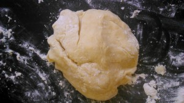

 
Идею данного рецепта мне предоставил журнал "Школа гастронома". Но в силу своих особенностей, я не смогла не исправить оригинальную версию.
 
По моему рецепту получаются печенья более воздушные, слегка влажноватые и не такие калорийные.
 
В процессе приготовления мне помогали мои девочки, было интересно наблюдать как они пытались слепить ежиков :-)
 
Для создания ежиков нам понадобятся:
 
1. 2,5 стакана муки (плюс минус 100 грамм).
1. Сливочное масло 80 грамм.
1. Йогурт 3,5 жирности (можно любой жирности или сметаны) 150 грамм.
1. Сахар 150 грамм (можно уменьшить или заменить медом 100 грамм).
1. Яйца 2 штуки.
1. Разрыхлитель теста 1 ч. л.
1. Соль 1/4 ч. л.
1. Шоколад темный (можно любой) 120 грамм.
1. Рубленные грецкие орехи 1/2 стакана.

 Приступим. Этап первый. "Как рождаются ежики". Для начала включите духовку при температуре 190 градусов. 
Сливочное масло нарезать мелкими кусочками, чтобы начинало таять. К нему добавляем сахар и разминаем вилкой до однородности.
 
Затем добаляем йогурт, начинаем взбивать.
 
Постепенно кладем яйца и тщательно взбиваем. Жидкость будет не совсем однородная, но так должно быть.
 
Просеиваем муку с разрыхлителем и солью.
 
Затем к нашей жидкости добавляем просеянную муку и сформировываем тесто.
 

 
Разделить тесто на несколько кусочков, размером с небольшой кулак.
 
Из кусочков делаем шарики, слегка приплюснув сверху. Заостряем одну сторону (мордочка у ежика).
 
Разложить наши ежики на бумагу для выпечки (или на смазанный маслом и посыпанный мукой противень). Сверху посыпать мукой.
 
На фото очень много муки (дочка увлеклась "солью").
 

 
Поставить в разогретую духовку на 8-10 минут.
 
Остудить на решетке.
 
Этап второй. "Как рождаются ежики 2".
 
Приготовить дробленные орехи (в блендере или просто отбить скалкой).
 
Растопить шоколад на водяной бане.
 
Остывшее печенье берем за мордочку и окунаем сначала в шоколад, а потом в орехи. Кладем остывать.
 
Любым острым предметом (зубочистка, кисть) рисуем глазки и носик.
 
И вот свершилось чудо! Появился ежик из ниоткуда!
 
 
 
Да, надо не забыть поставить готовых ежиков в прохладное место минут на 30.
 
Приятного аппетита!
 
