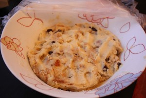

Есть замечательный рецепт печенья, который называется печенье "Все, что осталось".
 
Мой рецепт очень похожий, только с теми "осталось", что у меня было на полках и в холодильнике.
 
От новогодних сладких подарков остались карамельки типа "Му-Му", "Рачки" и т. д. Так мы их не съедим, а в печенье очень пригодились.
 
Как говорится в одной русской сказке "по сусекам помела, по коробу наскребла".
 
Так и обнаружились ингредиенты для этого вкусного печенья.
 
А еще для изготовления этого печенья пришлось немного пошуметь :-) В чем заключался шум сейчас узнаете.
 
Вам понадобятся:
 
1. Творог - 140 грамм (любой жирности).
1. Сливочное масло (комнатной температуры) - 60 грамм.
1. Яйцо - 1 шт.
1. Мука пшеничная - 325 грамм.
1. Соль 1 ч. л.
1. Разрыхлитель теста - 1,5 ч. л.
1. Шоколад (любой) - 70-80 грамм.
1. Сухофрукты (куряга, изюм, чернослив и т.д.) - 50 грамм.
1. Орехи (грецкие, фундук, кешью и т. д.) - 50 грамм.
1. Карамельки (сладкие, желательно молочной основы конфеты) - 50 грамм.

 Время выдержки теста в холодильнике от 2 часов. 
Все очень просто!
 
Кладем к творогу сливочное масло, яйцо и все тщательно перемешиваем. Откладываем в сторону.
 
Шоколад разламываем или есть один очень простой, но шумный способ: это не вынимая шоколад из упаковки, стучать им о твердую поверхность до состояния мелких кусочков.
 
Сухофрукты перемалываем или режем на маленькие кусочки.
 
Орехи проще перемолоть в блендере на маленькие кусочки.
 
С карамельками немного сложнее. Их проще сложить в пакет или полотенце и постучать по ним чем-нибудь тяжелым. Например, скалкой.
 
Так, все ингредиенты готовы к следующему этапу.
 
К творожной смеси добавляем муку, соль и разрыхлитель.
 
Затем кладем кусочки шоколада, орехов, сухофруктов и карамели.
 
Все тщательно перемешиваем и получаем такую разноцветную смесь.
 
Это то, что надо!
 

 
После, убираем наше тесто, прикрытое пленкой (пакетом) в холодильник на пару часов. Это для того, чтобы ингредиенты подружились и стали одной ароматной, сладкой компанией!
 
Заранее включаем духовку на 180 градусов.
 
Вынимаем тесто. Стол слегка посыпаем мукой и делаем из теста лепешечки небольшого размера.
 

 
(Кстати, те, что по-меньше делала моя старшая дочь :-))
 
Застилаем противень пекарской бумагой и пускаем наши печенья вперед в духовку!
 
Минут через 15 печенья готовы!
 

 
Даем немного остыть и все.
 

 

 
Всем приятного аппетита!
 

