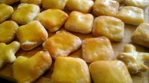

Сметана лежит и чего-то ждет. Думаю надо испечь печенье, просмотрела разные рецепты, чего-то не хватает. Добавили немного лимонной цедры и получилось то! Пекли мы вместе, я и мои девочки! А теперь посмотрим что получилось. Ингредиенты: 
1. Масло сливочное 80 грамм.
1. Сметала 200 грамм.
1. Сахар 70 грамм.
1. Яйца 2 штуки.
1. Мука 400 грамм (плюс 50 грамм на лепку).
1. Разрыхлитель 1,5 чайной ложки.
1. Цедра половины лимона.

 Ка все было. Включаем духовку на температуре 200 градусов. Взбиваем яйца, добавляем сахар, смешиваем до растворения. Добавляем мягкое сливочное масло (чтобы получить тесто слоеное), сметану, цедру лимона. И все тщательно перемешиваем.  Муку смешиваем с разрыхлителем, добавляем к смеси.  Замешиваем довольно мягкий колобок и кладем в холодильник, как минимум на 1 час. Охлажденное тесло раскатываем, формочками делаем заготовки.  И печем минут 15-20, в зависимости от толщины. Получаются пышные, не слишком сладкие печенья, с лимонным привкусом. Кстати, их можно начинить сладкой начинкой, разрезав пополам. Поскольку тесто получается слоеное. А можно украсить глазурью.  Приятное и полезное занятие с детьми!  
