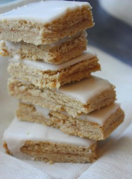
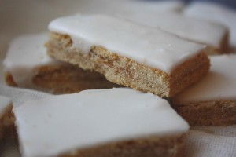

 
 
Необыкновенно вкусное рассыпчатое пирожное на основе песочного теста со сладко-кислой фруктовой начинкой и глазированное сахарной помадкой.
 
Тот самый вкус детского пирожного "Школьник" (или другое название глазированные "Полоски").
 
Стоимость индивидуальная.
 
Принимаются заказы от 300 грамм.
 
Для заявки надо перейти на страницу [Главная.](../-s)
 

