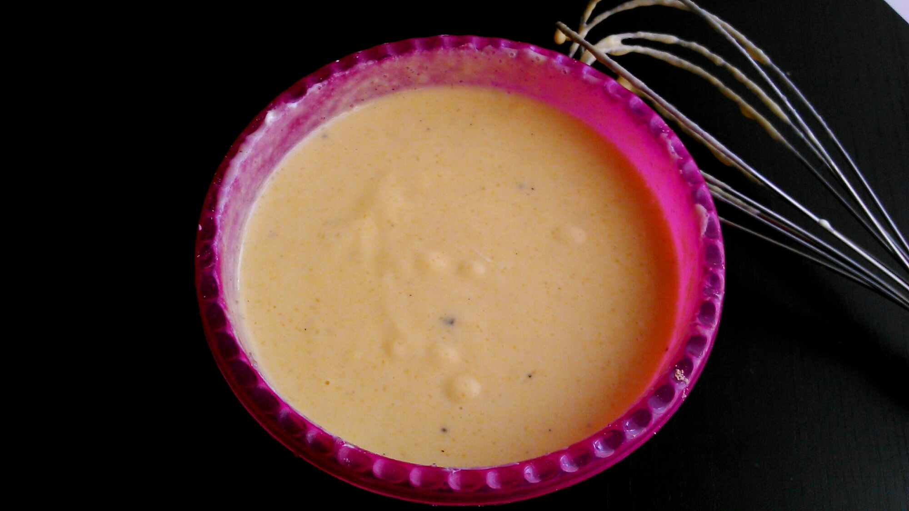
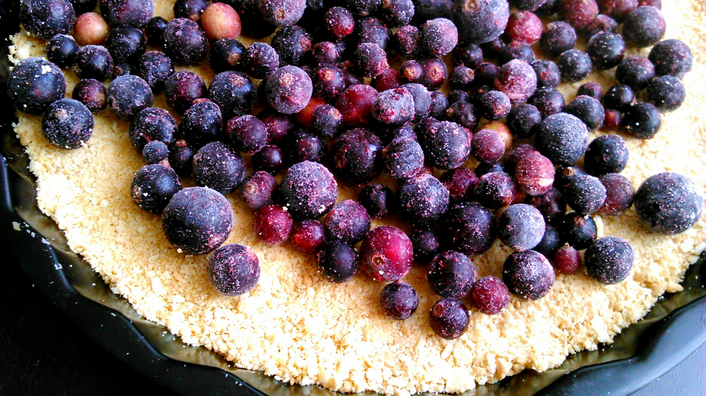
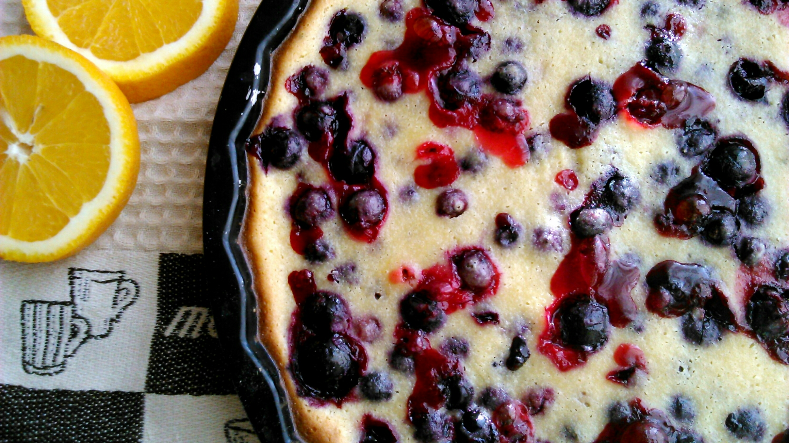
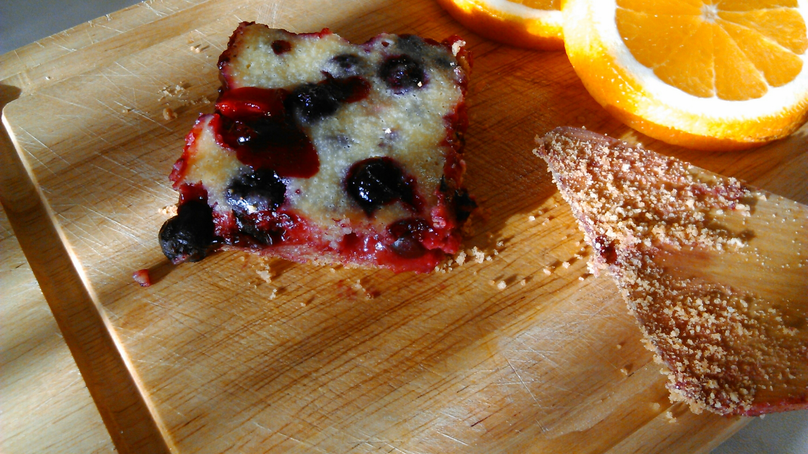

Люблю ягоды. Черная смородина со своей оригинальной кислинкой и при добавлении сахара всегда напоминает и будет напоминать мне детство, бабушкино варенье, лето! Замороженная смородина тоже прекрасно подойдет. Перейду к рецепту. Тесто: 
- масло сливочное 30 грамм,
- печенье любое 140 грамм,
- сахар (ванильный) 1 ч. л.,
- оливковое масло 2 ст. л.

 Начинка: 
- кукурузная мука 50 грамм,
- сахар (ванильный) 100 грамм,
- сметана 200 грамм,
- яйцо 1 штука.

 Начнем с теста. Раскрошим печенье, как для начинки чизкейка. Добавим мягкое сливочное масло (или растопленное), сахар и оливковое масло. Все хорошенько смешиваем до однородного состояния. Выкладываем в форму для запекания (у меня форма для пирогов диаметром 22-23 см.). Все прижимаем что под руку попадется, мне попался стакан. Его донышком прекрасно все примялось и разровнялось. И убираем форму в морозильную камеру минут на 10. В это время готовим начинку. Смешиваем сметану с сахаром, затем добавляем яйцо. Все венчиком замешиваем. Под конец добавляем кукурузную муку. Получается жидкая, приятная начинка.  В охлажденную форму с тестом выкладываем замороженную смородину, равномерно распределяя. Затем ягодки заливаем начинкой.  Кладем форму в духовку на 30-35 минут при 180 градусах. Как пирог будет готов, оставьте его в духовке не надолго, чтобы он отдохнул. Получается прекрасная крошка снизу, которую можно использовать как присыпку сверху пирога!  Приятного аппетита!  И до новых встреч!
