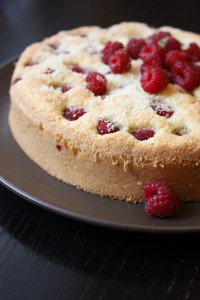
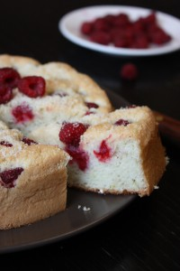
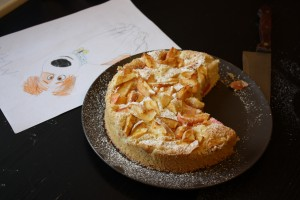
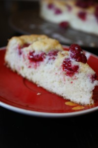

Есть замечательный сладкий десерт Шарлотка. Наш вариант пирога это родственник Шарлотки. И поскольку первый вариант состоит в оригинале только с яблоками, назовем наш эксперимент Малинник.
 
Тесто как для Шарлотки, так и для Малинника я предпочитаю по типу бисквитного и в этом я абсолютно солидарна с Ириной Чадеевой.
 
В отличие от пудингового теста (оригинальная версия для Шарлотки), бисквитное пышнее и воздушее.
 
И здесь мы можем вволю нафантазировать. Сделать просто бисквитное тесто с яблоками, ягодой и др., бисквитное тесто с добавками (какао; сливочное масло; пюре; ароматизаторы натуральные; орехи и много много другого), превратить нашу Шарлотку, Малинник, Клубничник, Ежевичник и тому подобное в полноценный сладкий десерт, который будет уже напоминать больше не пирог, а торт (полив его сиропом, молоком с сахаром, сливками и т. д.).
 
Так вот наш вариант это не просто бисквит, а с добавлением молотого миндаля, сливочного масла и цедры лимона, что придает пирогу некую завершенность во вкусе! Малинник получается слегка влажный за счет сливочного масла, ароматный благодаря лимонный цедры и с тонким оттенком орехов.
 
Для десерта понадобится:
 
1. 4 яйца
1. 110 грамм сахара
1. 20 грамм сливочного масла
1. 90 грамм муки
1. 30 грамм молотого миндаля (можно любого другого)
1. Цедра одного лимона
1. Малина (около 150 грамм)

 
Заранее разогрейте духовку до 200 градусов.
 
Отделите белки от желтков. Взбиваем желки с 80 гр. сахара до кремообразной белой массы. Отдельно в чистой посуде (чистым венчиком) взбиваем белки миксером на небольшой скорости. Это очень важно, так как именно небольшая скорость оборота венчика позволит равномерно расщепить белковую массу и она будет подниматься равномерно. Как только масса приняла обьем воздушной пены, добавляем тонкой струйкой оставшийся сахар (30 гр.) и продолжаем взбивать на средней скорости, добиваясь плотной блестящей массы. Взбитые белки готовы когда с венчика масса не опадает, а свисает.
 
Затем аккуратно вводим белки к желтковой массе. Перемешиваем лопаточкой от краев к центру, чтобы не потерять обьем.
 
После добавляем сразу всю просеянную муку, молотый миндаль и цедру лимона. Смешиваем по такому же принципу как указано выше.
 
Готовое тесто выкладываем в форму, заранее смазанную сливочным маслом и посыпанной мукой (это позволит нам легко вынуть изделие из формы).
 
И в конце, выкладываем сверху ягоды малины, равномерно распределяя по поверхности. Еще можно слегка присыпать сверху молотым миндалем.
 
Печем 25-27 минут в духовке при 200 градусах.
 
Очень важно!
 
При приготовлении бисквита, выпекать строго при заданной температуре, а не ниже, и не открывать дверцу духовки первые 15 минут точно. Иначе бисквит не понимется до нужного состояния.
 
Итак, наш Малинник готов! При этом по дому витает нежный аромат бисквитного мякиша в сочетании с ароматом лета и солнца!
 
Вынимаем форму из духовки и оставляем десерт в покое, чтобы он смог придти в себя. Вы сами заметите, минуты через 10-15 как бисквит самостоятельно отошел от стенок формы. Теперь можно наш Малинник вынимать и подавать к столу.
 
Приятного аппетита!
 
Bone appetite!
 
P. S. Прилагаю фотографию также Шарлотки с классическим вариантом бисквита. А еще Малинник можно проколоть шпажкой до дна по всей поверхности и полить смесью молока со сгущенным. Получается вариант Молочного пирога с малиной.
 

 

 
Шарлотка.
 

 
Малинник молочный.
 

