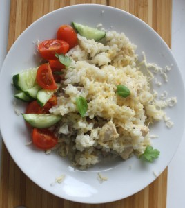

 Очередной, любимый в нашей семье рецепт «почти как от Джейми». Почему «почти»? Да потому, что мы живем в России, и ингредиенты доступнее наши местные, а не импортные. Технология и принцип приготовления точь в точь как у Джейми Оливера или Дженаро Контальдо (его наставника и друга). Пища получается необыкновенно вкусной, полезной в непривычной интерпретации. Я готовлю в мультиварке, можно прекрасно обойтись и кастрюлей с толстым дном на газу. Так, нам понадобится: 
1. Куриная грудка (можно половинку от целой).
1. Шампиньоны – штук 10.
1. Лук-порей – около половины стакана (по вкусу).
1. Рис круглозерный – 2 стакана.
1. Растительное масло с оливковым – 3 ст. л.
1. Сливочное масло 2 ст. л.
1. Кипяченая вода – 4-5 стакана.
1. Сыр полутвердый (например, «Российский»).
1. Соль, перец и специи по вкусу.
1. Любого белого полусладкого вина – 5 ст. л. (по желанию).

 Так, включаем мультиварку в режим «Жарка» или ставим кастрюлю или глубокую сковороду на средний огонь. Добавляем масло. В это время режем лук-порей на полукольца, затем нарезаем грудку полосками средней толщины, шампиньоны делим на 4-6 частей. Кладем в хорошо разогретую чашу лук, жарим минуты 2, затем кладем грудку, солим, перчим и продолжаем жарить минуты 5. После добавляем грибы и жарим все вместе еще минуты 2-3. Постоянно помешиваем деревянной лопаточкой. После истечения времени кладем весь рис и заливаем вином или теплой водой. Постоянно помешиваем. После выкипания жидкости добавляем по чуть-чуть теплую воду и помешиваем, чтобы не пригорало. Так готовим минут 15. Затем заливаем оставшейся жидкостью, прикрываем крышкой и убавляем газ. Оставляем томиться минут 5. Выключаем газ. Добавляем сливочное масло. Подача. Выкладываем порцию на тарелку, сверху кладем тертый сыр, слегка поливаем маслом. В дополнение зелень и овощи на ваш вкус и цвет! Вот и готово ризотто «почти как от Джейми»! Получается прекрасный рис, слегка вязкий и неоднородный по составу. Вино дает нам легкий аромат. А прекрасный сливочный вкус сыра завершает всю нашу композицию! Всем приятного аппетита!  Не бойтесь экспериментировать на кухне!  
