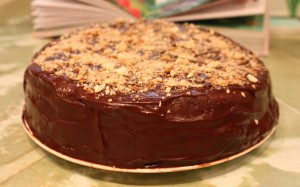
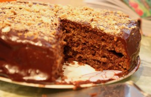

 

 
Для всех любителей и ценителей шоколадных десертов этот торт для Вас!
 
Берет - это не просто символ и неотъемлемая часть мужского национального костюма Страны Басков, но и символ шоколада. Поскольку баски были одними из первых поставщиков шоколада из Латинской Америки в Европу.
 
Торт состоит из шоколадного бисквита с прослойками сливочного крема из натурального шоколада (с содержанием какао белее 60%). Украшен шоколадной крошкой или кусочками безе.
 
Диаметр 23 см. Стоимость индивидуальная.
 
Для оформления заявки надо перейти на страницу [Главная.](../-s)

