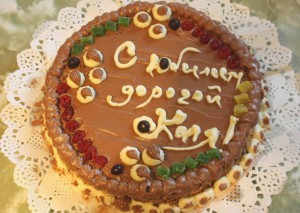
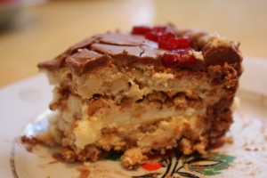

 

 
Удивительная история возникновения этого торта.
 
Однажды кондитеры забыли положить в холодильную камеру партию яичного белка, предназначенного для бисквита. На следующее утро начальник бисквитного цеха Константин Никитович Петренко с помощью 17-летней помощницы кондитера Надежды Черногор, чтобы скрыть ошибку коллег, на свой страх и риск переложил застывшие белковые коржи масляным кремом, посыпал ванильной пудрой, украсил поверхность цветочным орнаментом. Так появился предшественник торта, которому было суждено на долгие десятилетия стать визитной карточкой Киева.
 
Торт состоит из воздушно-ореховых коржей (орехи кешью) с прослойками сливочного крема с добавлением какао-порошка.
 
Украшением для торта являются: кремовые элементы (цветочки, ленточки и т. д.), цукаты, орехи или ореховая крошка, фрукты.
 
При желании можно заменить орехи кешью на фундук или арахис.
 
Диаметр 23 см. Стоимость 750 руб.
 
