 
Веселый, детский тортик, сделанный просто так!
 
Захотелось что-нибудь сладкого, с творожным кремом и непременно радостного :-)
 
Так и появился этот бисквитный торт, под названием "Конфетти". Название дала благодаря яркому внешнему оформлению, присыпки Конфетти.
 
Вам понадобится:
 
- Бисквит:

 
1. Пшеничная мука 100 грамм.
1. Цельнозерновая мука 20 грамм.
1. Сахар 100 грамм.
1. Яйца 4 штуки.

 
- Крем:

 
1. Творог (любой жирности) 200 грамм.
1. Сметана 25 % жирности.
1. Сгущенка 60 грамм.
1. Ванильный сахар 1 ст. ложка.
1. Сливочное масло 30 грамм.

 
- Сироп:

 
1. Вода кипяченная горячая около 150 мл.
1. Сахар 2 ст. ложки.
1. Коньяк 1 ч. л. (при желании).

 
- Для украшения:

 
1. Присыпка "Конфетти" (2 маленькие упаковки).
1. Мармелад (2-3 штуки).
1. Брусничное варенье (любое под ваше настроение и наличие в холодильнике :-)) где-то 5 ст. ложек.

 
Бисквит пеку за сутки до оформления торта. Это очень экономит время на приготовление целого торта и бисквит должен пролежать минимум 8 часов.
 
Бисквит я готовлю по основному принципу Чадеевой Ирины.
 
Только меняю по настроению ингредиенты :-)
 
Заранее разогрейте духовку до 200 градусов.
 
Смажьте круглую форма для торта (около 21-22 см. диаметром) сливочным маслом и посыпайте мукой.
 
Ну-с, приступим :-)
 
Яйца разделите на белки и жетки. Желтки взбиваем с 2/3 части сахара до кремового, почти белого цвета. Я взбиваю электрическим венчиком на максимальной скорости около 3-5 минут.
 
[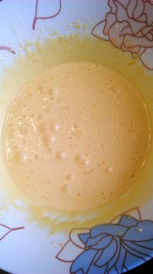](wpid-img_20140911_125038.jpg)
 
Отдельно взбиваем белки. Взбиваем чистым, промытым венчиком. Так как даже небольшое количество желтков или чего-нибудь другого могут испортить всю картину будущего!
 
Я обязательно кладу совсем маленькую щепотку (такую щепоточку :-)) соли. Взбиваем до пышности (где-то 1-2 минуты). А затем добавляем остаток сахара и еще взбиваем до образования воздушных "облаков", при этом ищеющими стойкую форму.
 
[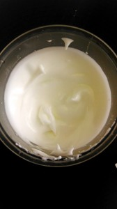](wpid-img_20140911_124936.jpg)
 
Аккуратно вводим белки в желтковую массы. Лопаточкой с краев к центру (по совету Чадейки). И это на самом деле действенно!!!
 
[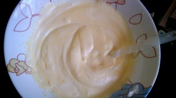](wpid-img_20140911_124839.jpg)
 
Муку пшеничную смешиваем с цельнозерновой.
 
Затем просеянную муку добавляем к нашей белково-желточной массе.
 
Также аккуратно, но не мешкая, перемешиваем все содержимое от краев к центру.
 
[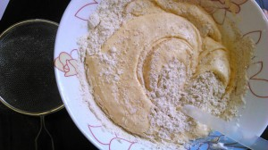](wpid-img_20140911_124740.jpg)
 
Выкладываем в форму и аккуратно ставим в заранее разогретую духовку. При 200 градусах на 25 минут. Я использоала мультиварку. И хочу признаться, что бисквит в мультиварке получается просто волшебный! (на 1 час в режиме Выпечка)
 
[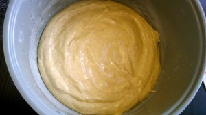](wpid-img_20140911_124649.jpg)
 
После приготовления, минуты 3-5 из духовки не вынимать. А вынув, положить на решетку остужать не менее 8 часов. Я оаствляю до следующего дня смело.
 
Наш прекрасный каркас для торта готов!
 
[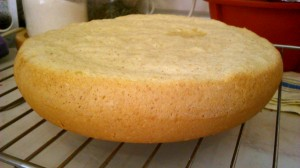](wpid-img_20140911_124544.jpg)
 
Кстати, основная часть сделана :-)
 
Приступаем к крему.
 
Заранее выньте то необходимое количество масла, чтобы оно было мягким.
 
А дальше, проще простого! Все ингредиенты смешиваем. Вначале творог с мягким сливочным маслом, затем кладем сметану, сгущенку, ванильный сахар. Советую класть натуральный ванильный сахар или немного натуральной ванили, что придает прекрасный ванильный аромат десерту. Я сама в этом убедилась, разок попробовав натуральную ваниль :-)
 
[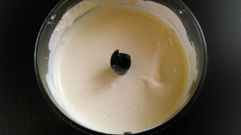](wpid-img_20140911_123150.jpg)
 
Последняя, самая творческая стадия, стадия сборки!
 
Разрезаем бисквит длинным ножом на три части. И совсем не беда, если что-то пошло криво, остановитесь и снова начните резать. Даже совсем криво очень замечательно! Все приходит с опытом :-)
 
[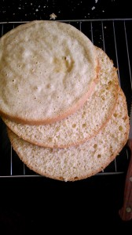](wpid-img_20140911_123045.jpg)
 
Выкладываем первый корж, поливаем с помощью кисточки сироп (смешанные вода с сахаром), затем намазываем на него варенье небольшим слоем. Далее идет слой крема, конечно по больше. Но с тем расчетом, что еще два коржа промазывать надо :-)
 
[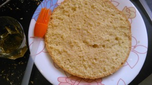](wpid-img_20140911_103025.jpg)
 
[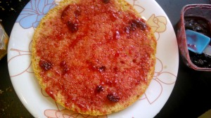](wpid-img_20140911_102911.jpg)
 
[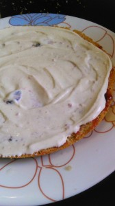](wpid-img_20140911_102734.jpg)
 
Остальные два коржа по такому же принципу.
 
[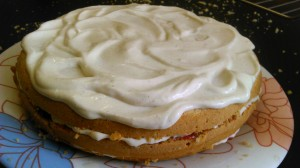](wpid-img_20140911_102617.jpg)
 
В завершение посыпаем присыпкой и выкладываем кусочки мармелада. На этот торжественный момент можно и пригласить детей! Им это понравиться. А главное они оценят, что мама доверила им украсить торт!
 
[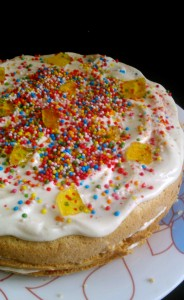](wpid-img_20140911_102204.jpg)
 
Приятного аппетита!
 
[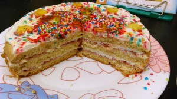](wpid-img_20140911_102313.jpg)
 
[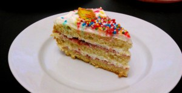](wpid-img_20140911_102449.jpg)
 

