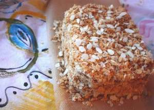
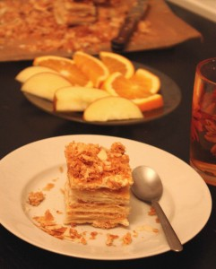
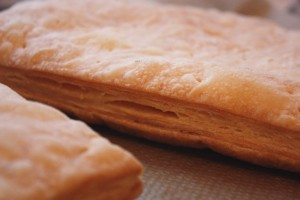

 

 

 
Хотите попробовать вкус советского торта "Наполеон"?
 
Тогда обращайтесь к нам и не пожалеете.
 
Свежее, слегка хрустящее слоеное тесто из сливочного масла и два слоя нежного ароматного крема "Шарлотт" (с добавлением натурального ванильного сахара и коньяка).
 
Для тех кто любит "помаслянистее" крема можно добавить (не больше 4 слоев крема).
 
Торт декорирован крошкой из слоеного теста и лепестками миндаля.
 
Размер торта прямоугольный (16 см.х22 см.), вес 600 грамм.
 
Стоимость индивидуальная.
 
Для оформления заявки надо перейти на страницу [Главная.](../-s)

