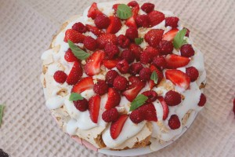

 
Прекрасный торт-безе со взбитыми сливками и неповторимыми фруктами и ягодами.
 
А какая интересная история возникновения этого торта.
 
Он назван в честь балерины [Анны Матвеевны Павловой](https://ru.wikipedia.org/wiki/%D0%9F%D0%B0%D0%B2%D0%BB%D0%BE%D0%B2%D0%B0,_%D0%90%D0%BD%D0%BD%D0%B0_%D0%9F%D0%B0%D0%B2%D0%BB%D0%BE%D0%B2%D0%BD%D0%B0), гастролировавшей по Австралии и Новой Зеландии в 1926 году. В те годы имя знаменитой танцовщицы носили многие бренды - шоколадные конфеты, одежда, духи.
 
Вкус этого чудесного торта не оставит никого равнодушным!
 
Его неповторимая легкость, хруст безе и конечно же аромат и сладость свежих ягод и фруктов.
 
Торт диаметром 23 см. Стоимость 600-700 рублей в зависимости от сезонности фруктов и ягод.

