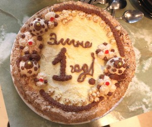
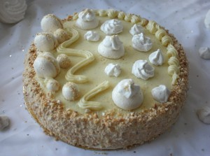
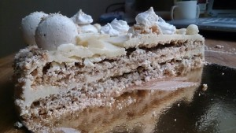

 

 

 
Торт "Полет" возможно многим и не знаком. Поскольку он был не так популярен в СССР, как "Птичье молоко" или "Прага".
 
Но он нисколько не уступает этим тортам по вкусу и впечатлениям.
 
Наверное так и есть, когда пробуешь кусочек этого дивного торта ты как-будто в полете своих фантазий и желаний!
 
Сказочный торт состоит из ореховых безе (орехи арахис) с прослойками крема Шарлотт с добавлением какао-порошка.
 
В нем очень много воздушности и очень много сладости. Так что этот тортик для настоящих сладкоежек!
 
Диаметр 23 см. Стоимость индивидуальная.
 
Для оформления заявки надо перейти на страницу [Главная.](../-s)

