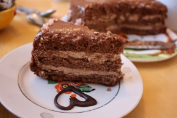
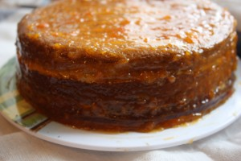
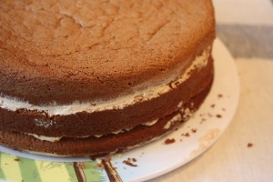

 

 

 

 
Торт созданный также в ресторане "Прага" (г. Москва), как и знаменитый торт "Птичье молоко".
 
Для кого-то поистине вкус детства!
 
Прекрасный шоколадный торт на основе бисквита и нежнейшего сливочного крема из сгущенного молока и сливочного масла.
 
Торт также украшен ароматным абрикосовым конфитюром и шоколадной помадкой (при желании шоколадной глазурью).
 
Диаметр 23 см. Стоимость индивидуальная.
 
Для оформления заявки надо перейти на страницу [Главная.](../-s)

