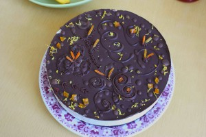
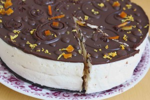
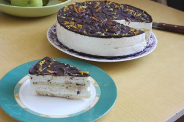
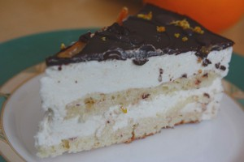

 

 

 

 
Знаменитый торт-суфле, созданный в СССР кондитером ресторана "Прага".
 
Нежнейшая начинка суфле из взбитых белков, сгущенного молока, сливочного масла.
 
Приятное ароматное тесто для коржей из ванильной масляной консистенции, которое просто тает во рту.
 
В дополнение декорирован шоколадом и цукатами.
 
При желании можно использовать Вашу любимую сладость!
 
Торт диаметром 23 см. Стоимость индивидуальная.
 
Для оформления заявки надо перейти на страницу [Главная.](../-s)

