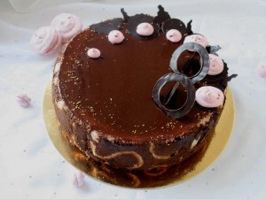

 
 
Просто удивительный шоколадный десерт!
 
Торт "Рив Гош" по рецепту кондитера Нины Тарасовой.
 
Если хотите приблизиться к роскоши Франции, попробуйте этот десерт на вкус!
 
В его составе: шоколадный бисквит без муки; шоколадно-малиновый мусс; малиновое крем-брюле; удивительный и неповторимый бордюр из сигаретного бисквита и бисквита "Джоконда" и конечно же зеркальная глазурь.
 
Стоимость индивидуальная.
 
Для оформления заявки надо перейти на страницу [Главная.](../shop)

