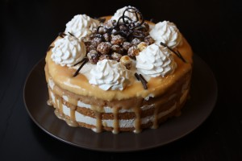
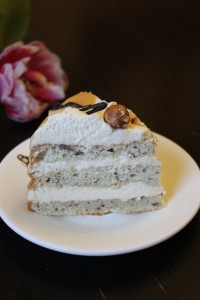

Карамель, карамель, карамель...
 
Многие просто ее обожают, другие не понимают, а некоторые не дооценивают.
 
На основе карамели можно приготовить огромное количество десертов, выпечки и даже она может выступать как завершающая нотка в основном блюде.
 
Вариант этого торта это на мой взгляд возвращение в прошлое, поскольку торт напоминает что-то из классики советского времени. Но в то же время это оригинальный вкус и современный вид!
 
В этом рецепте самое сложное это наверное сделать швейцарскую меренгу с использованием кулинарного градусника, но можно обойтись и без него.
 
Торт представляет собой бисквит с измельченным фундуком, масляный крем со швейцарской меренгой и карамелью, соленая карамель и декор: карамелизованные орехи с солью, взбитые сливки, шоколад.
 
Для бисквита вам понадобится: 1. 6 яиц (отдельно белки и желтки). 2. 140 грамм сахара. 3. 100 грамм муки. 4. 40 грамм молотых орехов (фундук в данном случае). 5. 40 грамм сливочного масла.
 
Для масляного крема со швейцарской меренгой понадобится: 1. Белки 4 штуки. 2. Сахар 190 грамм. 3. Сливочное масло 200 грамм. 4. Карамель 60 грамм.
 
Для рецепта карамели вам понадобится:
 
1. Сахар 100 грамм.
1. Мед 20 грамм (можно заменить глюкозой).
1. Сливочное масло 50 грамм (крупная щепотка соли морской или франзузской).
1. Сливки 33-35% жирности 100 грамм.

 
Для карамелизованных орехов понадобится:
 
1. Орехи фундук - грамм 100-150.
1. Сахарная пудра - 2 ст. ложки.
1. Щепотка соли морской.

 
Бисквит.
 
Бисквит можно печь как за сутки, так и в день сборки торта. Он получется довольно влажным и не нуждается в дополнительной пропитке.
 
(Можно дополнительно просмотреть по ссылке основные правила приготовления бисквита в домашних условиях с фотографиями - [Бисквит.](../tort-konfietti) )
 
Разогреваем духовку до 200 градусов.
 
Орехи измельчить ножом до маленьких кусочков. Почему ножом? Потому что при измельчении в блендере часть орехов начинает выделять масло и измельчение происходит не равномерно.
 
Желки отделяем от белков. Желтки взбиваем с половиной сахара до пышного состояния, почти белого цвета.
 
Белки взбиваем до пышной пены и добавляем оставшийся сахар. Продолжаем взбивать до плотности (до состояния облака).
 
Белки вмешиваем к желткам аккуратно. Затем добавляем просеянную муку и орехи. Перемешиваем аккуратно. И в конце добавляем растопленное масло (негорячее), вливая маленькой струйкой по краю. Перемешиваем недолго.
 
Выливаем в форму, смазанную сливочным масло и присыпанную мукой, или в рамку металлическую.
 
Я использовала круглую рамку диаметром 19,50 см.
 
Отправляем в духовку на 25-30 минут при 200 градусах.
 
Бисквит увеличится в несколько раз. По завершению выньте из формы и оставьте остужать на решетке.
 
Карамель.
 
Карамель можно изготовить разными способами. Найдите ваш любимый вариант.
 
Мой, пожалуй самый любимый, с мастер-класса кондитера Нины Тарасовой. Получается кремообразная нежная карамель.
 
Он готовится таким образом.
 
Сливки подогреваем заранее.
 
В ковшик кладем сахар, мед. Ставим на огонь (выше среднего) карамелизовать.
 
Очень важно чтобы весь сахар начал карамелизоваться и на стенках его не оставалось. Иначе все свернется и образуюся комочки сахара.
 
Не мешаем, а лишь покачиваем из стороны в сторону ковшик.
 
Дожидаемся коричневого оттенка, убираем с огня.
 
Добавляем подогретые сливки (нехолодные!) и активно перемешиваем. Можно смесь заново поставить на огонь не надолго.
 
В конце, после того как карамель немного остыла, добавляем сливочное масло и перемешиваем.
 
Наша карамель готова!
 
Хранить в холодильнике в плотно закрытой банке.
 
Крем.
 
Вариант крема из сливочного масла и взбитыми белками известен практически всем.
 
Белки взбиваются по варианту швейцарской меренги (на водяной бане).
 
Масло нужно вынуть из холода заранее, чтобы было комнатной температуры.
 
Миску с белками и сахаром кладем поверх кастрюли, в которой кипит вода. Дно миски воды не касается.
 
Начинаем взбивать миксером, можно и венчиком. Процесс взбивания будет недолгим, до растворения сахара или до достижения массы 62 градусов (как в некоторых источниках).
 
Затем вынимаем миску из кастрюли и уже отдельно взбиваем белковую массу до плотного пышного состояния.
 
Затем по чуть - чуть добавляем сливочное масло.
 
По завершению добавляем немного готовой (комнатной температуры) карамели. Это для легкого аромата карамели в креме.
 
Готовый крем можно убрать в холод до использования.
 
Карамелизованный фундук.
 
Это совсем несложно, но надо чувствовать когда стоит остановится.
 
На огонь поставьте сковороду, засыпьте около 2-х столовых ложек сахарной пудры и ждите пока она не расплавится и появится легкий карамельный оттенок.
 
Затем кладите к ним фундук щедрую щепотку соли морской и немного подержите на огне, переворачивая.
 
Снимите с огня и выложите на пергамент или силиконовый коврик до полного остывания. Будьте осторожны, орехи горячие!
 
Сборка торта.
 
Это наверное самое интересное.
 
Чтобы сделать ровные бока. Во внутренний круг можно положить по краю пергаментную бумагу, отрезать и скрепить скотчем края.
 
Бисквит разрезаем на три равные части.
 
Кладем первый слой бисквита в круг кольца (формы круглой). Поверх него выкладываем крем. Из расчета, что кремом будут смазаны все три коржа.
 
Кладем затем второй слой бисквита и так далее.
 
Собранный торт отправляем в холод на некоторое время (несколько часов).
 
Охлажденный торт вынимаем их кольца (формы), убираем бумагу и радуемся почти готовому торту!
 
Декор.
 
Декорировать торт можно на любой ваш вкус и цвет.
 
Мой вариант был таков.
 
Разогретую карамель поливаем по краю торта.
 
Выкладываем с помощью кондитерского мешка с насадкой фигурные детали из взбитых сливок.
 
В центр кладем карамелизованные орехи и украшаем шоколадным декором.
 
Можно перед самой подачи еще посыпать сахарной пудрой.
 
Торт "Карамельное танго" готов.
 

 

 
Приятного аппетита!
 
Bone appetite!

