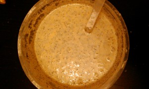

Впервые делала бисквит с молочной сывороткой (или на молоке) и делюсь рецептом с вами. Получился необычный, плотный, сладкий бисквит и к тому же маковый!
 
Поскольку просто бисквит это что-то для меня незавершенное, поэтому я сделала по этому поводу торт.
 
Торт необычный, на вкус и цвет, и делался на скорую руку. Как обычно бывает с хозяйками, которые ждут гостя и быстро пытаются что-то сочинить. Именно так со мной и произошло.
 
Для бисквита на молочной сыворотке:
 
1. Молочная сыворотка (или молоко) 150 мл.
1. Сливочное масло 80 грамм.
1. Яйца - 3 шт.
1. Мука пшеничная - 140 грамм.
1. Крахмал картофельный - 25 грамм.
1. Сахар - 160 грамм.
1. Мак - 50 грамм.
1. Соль - щепотка.
1. Лимонный сок - 1 ч. л.

 
Делала бисквит в мультиварке. Если же духовка, то включите ее разогреваться при 200 градусах.
 
Заранее приготовьте форму. Смажьте ее сливочным маслом присыпьте слегка мукой.
 
Ставим молочную сыворотку и масло в кастрюле на медленный огонь, разогреваться.
 
Яйца с сахаром взбиваем миксером (венчиком) до пышного состояния, добавляем щепотку соли и немного лимонного сока и продолжаем взбивать до пышно-пузырчатого состояния.
 
Крахмал, муку и разрыхлитель соединяем вместе и дружной компанией просеиваем через сито в яичную смесь.
 

 
Активно и ритмично все перемешиваем от краев к центру.
 
Затем выливаем подогретую сыворотку с маслом, перемешиваем.
 

 
В конце добавляем мак и снова все тщательно перемешиваем.
 

 
Вот такая полужидкая, но пластичная масса идет за основу бисквита.
 
Ставим в мультиварку в режиме "Выпечка" (на 1 час) или в заранее разогретую духовку при 200 градусах на 25 минут.
 

 
Переходим к крему.
 
Для него нам понадобятся:
 
1. Манная каша - 180 грамм.
1. Сливочное масло- 70 грамм.
1. Сахарная пудра - 1/2 стакана.
1. Лимонный сок - 2 ч. л.
1. Цедра 1/2 лимона.

 
Тут ничего экзотичного нет, обычный манно-масляный крем.
 
Мягкое сливочное масло взбиваем с сахарной пудрой до пышно-мягкой консистенции, затем добавляем манную кашу, лимонный сок и цедру и еще немного взбиваем до однородности.
 
В качестве ароматной фруктовой начинки я использовала лимонный курд. Смотрите рецепт здесь - [Лимонный курд.](../limonnyi-kurd-kriem)
 
Переходим к изготовлению белковой массы. Рецепт изготовления смотрите в разделе про [Тортик "Цветочный"](../tortik-tsvietochnyi). Только на сей раз я брала не 2 белка, а 3 белка и 150 грамм сахара.
 
Собираем наш тортик.
 
Разрезаем бисквит на две части. Промазываем первый корж манно-маслянным кремом, затем сверху выкладываем лимонный крем.
 
Кладем второй корж, промазав его лимонным кремом немного.
 
Выкладываем белковую массу и распределяем все по поверхности (верх и бока). Стараемся спрятать наш тортик ка можно лучше.
 

 
Получаем большую белую шапку, кладем в заранее разогретую духовку (на максимум) минут на 5-7.
 
Вынимаем торт и ставим в холод.
 
Дополнительно украшаем зефиром и лимонной цедрой.
 
Вот наш сказочно-белый тортик готов!
 
Но стоит его откусить и вы прочувствуете кисло-сладкую симфонию вкуса! И это волшебно!
 
P. S. Есть много нюансов, которые я не описала. Но в каждом случае своя история со своими нюансами. Важно было бы отметить, что я так торопилась, что белки чуть недовзбились и соответственно не так плотно стояли. Отсюда и результат, они местами потекли.
 
Чтобы исправить ситуацию я украсила торт зефиром.
 
Когда торт пробовали и ели уже никто не думал как он был украшен, потому что мысли были где-то далеко далеко........
 

 
Всем кулинарных открытий!
 

