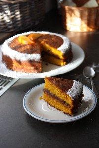

Не хватает солнца и ярких впечатлений?
 
А может кусочек тортика и утро станет еще волшебнее!
 
Рецепт его очень простой и легкий, надо только немного фантазии и желания и все будет намного солнечнее чем обычно.
 
Бисквит я сделала по рецепту [о ярком тыквенном пироге.](../iarkii-pirogh-s-tykvoi-i-morkovkoi)
 
В качестве крема использовала джем из цитрусовых и моркови (можно конечно покупной вариант) и шоколадный ганаж из темного шоколада, сливочного масла и оставшегося пюре из тыквы.
 
А в довершении я посыпала сахарной пудрой и украсила несколькими кусочками хурмы.
 
Где-то час-полтора вашего времени и чудный солнечный лучик у вас на блюдце.
 
Приятного чаепития и ярких впечатлений!
 
Bone appetite!
 

 

 

