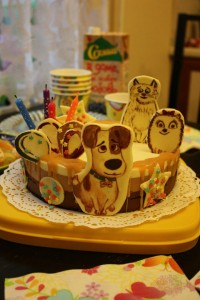

Привет всем!
 
Сегодня я хочу рассказать о моем опыте изготовления торта "Три шоколада" по рецепту из YouTübe.
 
Как правило есть два основных примера изготовления этого знаменитого десерта. Первый вариант с кремовой основой a Pâte à bombe (от французского дословный перевод "бомба-тесто") делается как заварной крем из желтков, сахара и воды. Мусс на основе a Pâte à bombe получается нежным, кремовым.
 
Второй вариант более простой, без кремовой основы a Pâte à bombe, просто на ганаше из сливок и шоколада.
 
Как раз про второй вариант я хочу и рассказать.
 
Тортик готовился к дню рождения моей младшей дочери и в довольно экстремальных условиях (в связи с переездом), поэтому я решила сделать более простую версию, на основе ганаша. Мусс получается более плотным и трюфельным, в отличие от первого варианта, но тем не менее вкусным!
 
Предлагаю для наглядности просмотреть видео в YouTube.
 
1. [https://www.youtube.com/watch?v=MhUB4Us8BIo](https://www.youtube.com/watch?v=MhUB4Us8BIo)
1. [https://www.youtube.com/watch?v=8ka3N4Nr5FY&feature=youtu.be](https://www.youtube.com/watch?v=8ka3N4Nr5FY&feature=youtu.be)

 
Первое видео (на английском языке) с первым вариантом изготовления десерта.
 
Второе видео (на испанском или португальском языке, даже не знаю) это наш вариант.
 
Итак, нам понадобится для бисквита:
 
1. 65 грамм муки
1. 125 мл молока
1. 60 грамм сахара
1. 60 грамм сливочного масла
1. 20 грамм какао-порошка
1. 1 яйцо
1. немного соли
1. 1/2 ч. л. соды

 
Для мусса из темного шоколада:
 
1. 300 грамм темного шоколада
1. 250 мл сливок (33-35 % жирности)
1. 50 мл. холодной воды
1. 40 грамм сливочного масла
1. 5 грамм желатина

 
Для мусса из молочного шоколада:
 
1. 300 грамм молочного шоколада
1. 250 мл сливок (33-35 % жирности)
1. 50 мл. холодной воды
1. 40 грамм сливочного масла
1. 5 грамм желатина

 
Для мусса из белого шоколада:
 
1. 300 грамм молочного шоколада
1. 250 мл сливок (33-35 % жирности)
1. 50 мл. холодной воды
1. 40 грамм сливочного масла
1. 10 грамм желатина

 
Разогреваем духовой шкаф до 185 градусов.
 
В это время взбиваем мягкое сливочное масло с сахаром до однородного кремового состояния. Затем добавляем яйцо и снова взбиваем. Далее добавляем молоко, смешиваем и все сухие ингредиенты через сито. Перемешиваем. Тесто выкладываем в форму круглую или просто выравниваем по противню ровным слоем диаметром будущего торта, на пекарской бумаге или коврике.
 
Кладем тесто в духовку при 185 градусов и на 15-20 минут.
 
К изготовлению муссов приступаем только тогда когда готов остывший корж бисквита. Поскольку мы его выкладываем в форму, куда в дальнейшем будем заливать муссы по очереди (темный, молочный и белый). Можно сделать версию перевернутую, то есть в форму без бисквита заливаем вначале мусс из белого шоколада, затем молочного и только потом темного шоколада, а затем прикладываем корж бисквита сверху.
 
Заранее напишу, что на мой торт диаметром 20-21 см мне хватило ровно по 2/3 части муссов, остальную часть я заливала в маленькие силиконовые формочки, в дальнейшем маленькие муссовые пирожные "Три шоколада".
 
Я делала в этот раз по версии из видео, то есть клала корж, а потом все заливала.
 
Замачиваем 5 грамм желатина 50 мл воды минут за 10-15 до работы с ним.
 
Готовим кастрюлю с водой и миску (чистую и сухую!) для того, чтобы в ней топить наш шоколад на паровой бане.
 
Темный шоколад топим вместе со сливочным маслом. Будьте внимательны, не перетопите! Я в этом случае немного перетопила и в итоге мусс из темного шоколада не получился таким какой нужен был и имел консистенцию рыхлости, а не плотным, однородным.
 
Как только растопленный шоколад с маслом принял температуру комнаты, мы в него добавляем взбитые сливки.
 
Выкладываем первый слой мусса поверх коржа бисквита и отправляем в холодильник. Для более ровного слоя можно воспользоваться кондитерским мешком.
 
Второй мусс делаем из молочного шоколада.
 
Делается абсолютно по такому же принципу, как и первый. Заливаем поверх мусса из темного шоколада и в холодильник.
 
Третий мусс немного отличается от предыдущих двух, добавляем 10 грамм желатина, а не пять, так как белый шоколад более мягкий нежели предыдущие виды шоколада и хуже держит форму. В остальном, принцип изготовления такой же.
 
Заливаем белый шоколад поверх молочного и отправляем в холодильник или в морозильник, если вы не планируете есть его завтра-послезавтра.
 
Затем достаете из формы или вынимаете из формы, пищевой ленты и тому подобное. Выкладываете на блюдо и торт "Три шоколада" готов!
 
Осталось самое интересное для каждой хозяйки это украшение! Хотя в первоначальном виде он тоже очень хорош.
 
В моем случае я использовала карамель, декор из темперированного шоколада и присыпку.
 
Фантазируйте и ничего не бойтесь!
 
Bone appetite!
 

 

