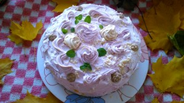
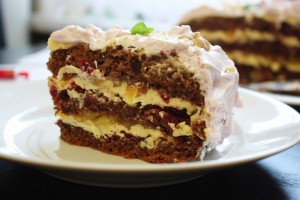

  
 
Необычный торт весь белоснежный снаружи и шоколадный внутри.
 
Торт с шоколадным бисквитом, пропитанный сладким сиропом, в дополнение кусочками консервированных ананасов и вишни, с прослойками крема Шарлотт (заварной крем из молока и яиц) и отделан воздушными белками и кусочками цукатов.
 
Белки взбиваются на водяной бане ("швейцарская меренга"), а затем торт с белковой отделкой немного карамелизируется в духовке, как в десерте "Аляска".
 
Диаметр 23 см. Стоимость 650 руб.

