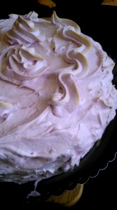
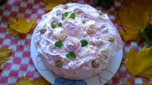
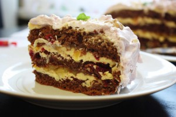

В октябре моей малышке Элине исполнилось 2 года! По такому случаю мы (я и старшая дочь Полиночка) организовали тортик. По задумке тортик должен был быть и шоколадным и воздушно-белым одновременно. В итоге, получился прекрасный торт с шоколадным бисквитом, кремом Шарлотт с воздушной белковой отделкой. Даже показалось, что есть что-то схожее с тортом Прага по вкусу.
 
Попробуйте и вы все поймете!
 
Вам понадобятся:
 
- Для бисквита:

 
1. Яйца 4 штуки.
1. Мука пшеничная 85 грамм.
1. Картофельный крахмал 15 грамм.
1. Какао-порошок 25 грамм.
1. Сахар 125 грамм.

 
- Для крема Шарлотт:

 
1. Сливочное масло (комнатной температуры) 200 грамм.
1. Яичные желтки 2 шт.
1. Сахар 170 грамм.
1. Ванильный сахар 1 ч. л.
1. Молоко 125 грамм.

 
- Сироп и начинка:

 
1. Компот от консервированных ананасов.
1. Консервированные ананасы.
1. Любое варенье с кислинкой (использовала вишневое без косточек).

 
- Для меренги (белковой шапочки)

 
1. Яичные белки (комнатной температуры) 2 шт.
1. Сахар или сахарная пудра 100 грамм.
1. Щепотка соли и капелька лимонного сока.

 
Для начала разогрейте духовку до 200 градусов. Смажьте форму для выпечки сливочным маслом и посыпайте слегка мукой (обычно используют круглую форму 20-22 см. диаметром).
 
Или воспользуйтесь мультиваркой. Однажды, попробовав испечь бисквит в мультиварке, я остановилась на таком способе приготовления. Без проблем, без подгораний, и всегда готова пышная основа для торта!
 
Итак, приступим к изготовлению шоколадного бисквита.
 
Разделите белки от желтков. Желтки смешайте с 2/3 части сахара и взбивайте до получения почти светлой массы.
 
Белки начинайте взбивать в чистой и глубокой посуде, так как они увеличатся как минимум в двое. Белки должны быть одни, без компании каких-нибудь посторонних друзей, например элементов желтка. Иначе, белки не примут необходимую текстуру!
 
К белкам положите щепотку соли. Белки взбивайте до получения пышной, воздушной массы, затем кладите остальную часть сахара, продолжайте взбивать, немного лимонного сока, и взбиваем до образования воздушных пиков.
 

 
Аккуратно выкладываем белковую массу к желтковой массе. Используя метод Чадеевой Ирины, замешивая лопаточкой от краев к центру. Старайтесь делать это ритмично, но не часто, чтобы белки не потеряли свою пышность.
 

 

 
К муке добавьте крахмал, какао-порошок и всю эту мучную смесь просейте к нашей белково-яичной массе.
 
Аккуратно замешиваем от краев к центру. Все!
 

 

 
Выкладывайте смесь в чашу мультиварки на режим "Выпечка" (1 час), или в форму и в духовку на 25 минут при 200 градусах.
 
Бисквит пеку за сутки, так как это экономит и силы и время и дает возможность на некоторую фантазийную свободу :-)
 
Принимаемся за крем Шарлотт.
 
Этот крем прекрасный, не слишком жирный, воздушный и нежный.
 
Желтки смешать с молоком в кастрюльке (ковшике), добавить сахар и поставить на средний огонь. Варить до состояния густого сиропа (минут 5-7). Оставляем остужать до теплого (прохладного) состояния.
 

 
Размягченного сливочное масло взбиваем венчиком. Затем добавляем остывший сироп. Хорошенько смешиваем.
 
Крем Шарлотт готов!
 

 
А теперь самое несложная и на мой взгляд, художественная стадия, стадия сборки.
 
Разрезаем бисквит на три части. Я использую длинный зубчатый (кажется для рыбы) нож. Даже если неровно, это не главное! Главное вкус :-)
 

 
Смазываем первый корж сиропом (при желании можно добавить 1 ст. л. коньяка).
 

 
Затем смазываем его слоем крема. Учтите, что вам еще два коржа смазывать кремом. А сверху выкладываем нарезанные кубиками ананасы.
 
Кладем сверху второй корж и действуем по такому же принципу как и с первым, только вместо сиропа я использовала варенье вишневое.
 

 
Промазав третий корж. Почти готовый торт уберите в холод.
 
Займемся меренгой или как я называю эту вкусную вещь, белковой шапочкой :-)
 
Включите духовку на максимум (у меня это 240 градусов).
 
Поставьте кастрюлю с водой на огонь, для того чтобы использовать ее для эффекта водяной бани.
 
Над кипящей водой, в чистой глубокой посуде взбиваем белки с щепоткой соли до пышного состояния, затем добавляем сахар (или сахарную пудру) и взбиваем до состояния твердых, устойчивых пиков. А, да, я добавила еще несколько капель клюквенного сока, чтобы получился слегка розовый оттенок!
 

 
Можно делать и без водяной бани, если вы уверены в качестве яиц или используете деревенские яйца.
 
Вынимаем торт из холодильника, выкладываем толстым слоем белковый крем на торт (верх и бока) или используя конверт, украшаем его цветами.
 
Ставим торт на жаропрочную подставку и в сильно разогретую духовку на 5 минут.
 
Этого будет достаточно, чтобы белки схватились и приняли слегка румяный оттенок. И совсем не надо паниковать если немного растекся крем под шапочкой :-) Поверьте это прибавит шарму вашему творению!
 

 
Пожалуй наш праздничный торт готов!
 
Конечно можно добавить в качестве украшения разные детали, как например, листочек свежей мяты!
 

 
Приятного чаепития и сказочного настроения!
 

 

 

 

