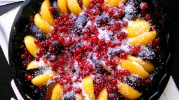
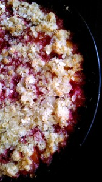

С таким легким и доступным блюдом я познакомилась благодаря Чадеевой Ирины. Мой же вариант совесм другой от оригинала. Десерт настолько быстро приготавливается, что вы и не заметите, как он уже готов! :-) Вам понадобятся: 
- Тесто:

 
1. Творог 200 грамм.
1. Масло сливочное 50 грамм.
1. Мука пшеничная 60 грамм.
1. Сахар 50 грамм.
1. Хлопья ячменные (можно любые другие) 30 грамм и 2 ст. л. сахара к ним.

 
- Начинка:

 
1. Абрикосы 5 шт.
1. Сливы 5 шт.
1. Красная смородина 200 грамм.
1. Сахар 2 ст. ложки.

 Для начала ставим духовку на разогрев при 200 градусах. Форму смазываем любым маслом. Начинку кладем в форму и обсыпаем сахаром.  Для теста, смешиваем творог, масло, муку в крупную крошку (масло крошим). Выкладываем крошку на начинку.  Сверху досыпаем хлопьями и сахаром. Сатвим в духовку при 200 градусах на 25 минут. Вот и готова наша ароматная, хрустящая крошка!   Приятного аппетита! 
