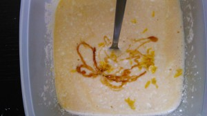

Этот тот самый вид обычной запеканки.
 
Для ее приготовления разве что и надо миску, ингредиенты, вилку для смешивания :-) Ну конечно же не обойтись без мультиварки!
 
Ерунда, если таковой нет, можно ее запросто исчеть и в духовке при 180 градусах 40-45 минут.
 
Вам понадобятся:
 
1. Творог (любой жирности) 210 грамм.
1. Йогурт 2 ст. ложки (или сметаны).
1. Яйца 3 штуки.
1. Сахар 3 ст. ложки.
1. Манка 2 ст. ложки.
1. Мед и цедра лимона по желанию (мед 1 ст. ложку, цедра 1/2 лимона).

 
Для начала смажьте чашу мультиварки маслом сливочным.
 
Творог, йогурт и манку смешиваем.
 
Отдельно взбиваем вилкой яйца и сахар. Пожалуйста, можно и венчиком :-)
 
Все ингредиенты смешиваем и в конце добавляем мед и цедру.
 

 
Выкладываем в чашу и включаем режим "Выпечка".
 
У моей мультиварки этот режим длиться 1 час.
 
Ну вот и все!
 

 
Приятного аппетита!
 
